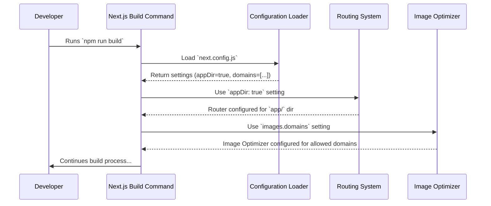

# Chapter 1: Next.js Framework Configuration

Welcome to the EnvKeyVault tutorial! We're excited to guide you through building this application. This first chapter dives into setting up the core engine of our web application: the Next.js framework.

## What's the Big Idea? Configuring Our Web App's Engine

Imagine you're building a custom car. You need an engine, right? And you need to decide how that engine works – how fast it goes, what kind of fuel it uses, maybe some special features.

In web development, **Next.js** is like our powerful, modern car engine. It helps us build fast, user-friendly web applications. But just like a car engine, we need to configure it! We need to tell Next.js *how* we want our application to be structured and behave.

**Our Goal (Use Case):** Let's say we want to build our app using a new, organized way to structure our pages (like having a special `app/` folder for all page-related code). We also want to display user profile pictures directly from Twitter in our application, and we want Next.js to automatically optimize these images for us so they load quickly.

This chapter will show you exactly how to tell Next.js to do these two things using its main configuration file.

## Meet the Control Panel: `next.config.js`

Next.js looks for a special file in the root of our project called `next.config.js`. Think of this file as the **main control panel** for our Next.js engine. It's where we give instructions to Next.js.

Here's the configuration file for our EnvKeyVault project:

```javascript
// File: next.config.js

/** @type {import('next').NextConfig} */
const nextConfig = {
  experimental: {
    appDir: true, // Use the new 'app/' directory for pages
  },
  images: {
    // Allow images from these specific websites
    domains: ["twitter.com", "pbs.twimg.com"],
  },
};

module.exports = nextConfig;
```

Let's break down what these settings mean.

## Key Settings Explained

This configuration file might look simple, but it controls important parts of our application. We'll look at two main sections: `experimental` and `images`.

### 1. Experimental Features: Trying Out the New Stuff (`experimental`)

Sometimes, the creators of Next.js add new features that are promising but still being tested. These go into the `experimental` section.

```javascript
  experimental: {
    appDir: true, // Use the new 'app/' directory for pages
  },
```

*   **`appDir: true`**: This is the important setting for our use case. By setting this to `true`, we're telling Next.js: "Hey, I want to use your newer way of organizing pages and layouts. Please look for my pages inside a folder named `app/` instead of the older `pages/` folder."
    *   **Analogy:** Think of choosing a modern, open-concept floor plan (`appDir: true`) for your new house instead of a more traditional layout. It changes how the rooms (pages) are structured.
    *   **Why?** The `app/` directory offers better ways to handle layouts, loading states, and errors, making our code cleaner and more organized.

### 2. Image Optimization: Handling Pictures Smartly (`images`)

Websites need images, but large images can make a site load very slowly. Next.js has a fantastic built-in feature to automatically optimize images (resize them, change their format) to make them load faster.

However, if we want to use images hosted on *other* websites (like Twitter), we need to give Next.js permission first for security reasons.

```javascript
  images: {
    // Allow images from these specific websites
    domains: ["twitter.com", "pbs.twimg.com"],
  },
```

*   **`domains`**: This setting is a list of website addresses (domains) from which Next.js is allowed to download and optimize images.
    *   **Analogy:** Imagine your house has a security guard (Next.js Image Optimizer). You need to give the guard a list of approved delivery companies (the `domains`) whose trucks (images) are allowed onto your property.
    *   **Why?** In our use case, we want to show Twitter profile pictures. These images are often hosted on `pbs.twimg.com` (Twitter's image server) or linked from `twitter.com`. By adding these domains here, we allow Next.js to safely fetch and optimize these external images when we use Next.js's special `<Image>` component in our code.

## Putting it Together: Solving Our Use Case

So, how does this `next.config.js` file help us achieve our goal?

1.  **Organized Pages:** Because we set `experimental: { appDir: true }`, Next.js will now expect our pages (like the main homepage or a settings page) to be created inside the `app/` directory at the root of our project. This enforces the new structure we wanted.
2.  **Optimized Twitter Images:** Because we added `"twitter.com"` and `"pbs.twimg.com"` to `images.domains`, if our code tries to display an image using `<Image src="https://pbs.twimg.com/some-profile-pic.jpg" ... />`, Next.js will:
    *   Recognize that `pbs.twimg.com` is an allowed domain.
    *   Download the image during the build or on demand.
    *   Optimize it (resize, compress, maybe convert to a modern format like WebP).
    *   Serve the optimized image to the user, making the page load faster.

Without these settings, Next.js would either look for pages in the wrong place or refuse to optimize images from Twitter, potentially showing an error.

## Under the Hood: How Next.js Uses the Config

It's helpful to peek behind the curtain and see *when* and *how* Next.js uses this configuration.

**The Process (Simplified):**

1.  **You run a command:** You start your development server (`npm run dev`) or build your application for production (`npm run build`).
2.  **Next.js starts:** The Next.js command-line tool wakes up.
3.  **Config Check:** One of the first things Next.js does is look for the `next.config.js` file in your project's main directory.
4.  **Reading Settings:** It reads the settings you defined inside `module.exports`.
5.  **Applying Rules:**
    *   It sees `experimental.appDir: true` and tells its internal "router" (the part that maps URLs to pages) to look for page files inside the `app/` directory.
    *   It sees `images.domains` and tells its internal "image service" which external websites are safe to fetch images from for optimization.
6.  **Continuing Work:** With these rules applied, Next.js proceeds with starting the server or building the application according to your configuration.

**Visualizing the Process:**

Here's a simple diagram showing the flow when you build the application:



**The Code:**

The beauty is that the code enabling this is simply the `next.config.js` file itself!

```javascript
// File: next.config.js
/** @type {import('next').NextConfig} */
const nextConfig = {
  // Settings go here...
};

// This line makes the settings available to Next.js
module.exports = nextConfig;
```

Next.js is designed to automatically find and use this `module.exports` object. We don't need to write complex code to connect it; we just need to define our desired settings within this specific file structure.

## Conclusion

Congratulations! You've taken the first step in understanding how EnvKeyVault is built. You learned that Next.js is the core framework (our application's engine) and `next.config.js` is its control panel. We saw how simple settings in this file allow us to enable major features like the modern `app/` directory structure and optimized image handling for external sources like Twitter.

Now that we have the basic framework configured, the next step is to think about how our application will *look*. How do we style the buttons, text, and layout? That's where Tailwind CSS comes in.

Ready to make things look good? Let's move on to [Chapter 2: Tailwind CSS Styling Configuration](02_tailwind_css_styling_configuration.md).

---

Generated by [AI Codebase Knowledge Builder](https://github.com/The-Pocket/Tutorial-Codebase-Knowledge)