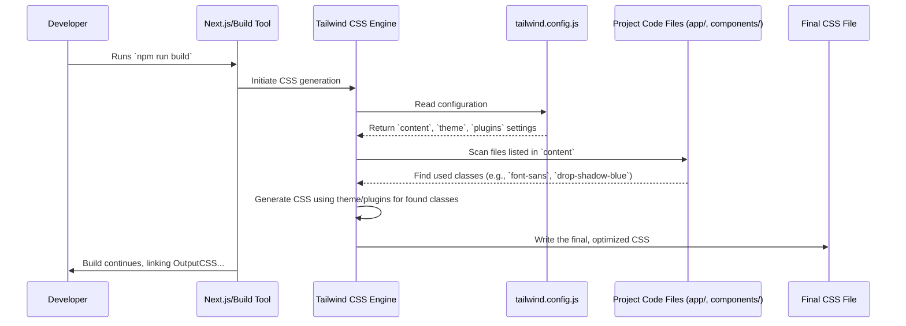

# Chapter 2: Tailwind CSS Styling Configuration

Welcome back! In [Chapter 1: Next.js Framework Configuration](01_next_js_framework_configuration.md), we set up the basic engine and structure for our EnvKeyVault application using Next.js. We configured *how* the application works fundamentally. Now, let's focus on *how it looks*!

## What's the Big Idea? Defining Our App's Look and Feel

Imagine you're an artist getting ready to paint. You wouldn't just grab random tubes of paint, would you? You'd likely have a specific palette of colors you want to use, maybe specific brushes for certain effects, and a particular style in mind. This ensures your painting looks consistent and intentional.

Similarly, when building a web application, we want a consistent visual style. Buttons should look similar, text should use the same fonts, and spacing should be predictable. **Tailwind CSS** is a fantastic tool that helps us achieve this by providing pre-built "utility classes" we can apply directly in our HTML. But how do we define *our* specific project's style guide – *our* color palette, *our* fonts, *our* special visual effects?

That's where the Tailwind CSS configuration file comes in!

**Our Goal (Use Case):** For EnvKeyVault, let's say we want two specific styling goals:
1.  Use a clean, modern font called "Inter" for all the standard text in our application.
2.  Create a special visual effect: a subtle "blue glow" (a drop shadow) that we can easily add to important buttons or elements to make them stand out.

This chapter will show you how we use the Tailwind configuration file to define these custom styles, making them available for use throughout the project.

## Meet the Style Guide: `tailwind.config.js`

Just like Next.js has `next.config.js`, Tailwind CSS looks for its own special configuration file, usually named `tailwind.config.js`, in the root of our project. Think of this file as the **master style guide** or the **artist's palette** for our application's design.

Here's the configuration file for EnvKeyVault:

```javascript
// File: tailwind.config.js

// Import the default theme settings from Tailwind
const defaultTheme = require("tailwindcss/defaultTheme");

/** @type {import('tailwindcss').Config} */
module.exports = {
  // 1. Tell Tailwind where to find our classes
  content: [
    "./app/**/*.{js,ts,jsx,tsx}",
    "./pages/**/*.{js,ts,jsx,tsx}", // Also check older 'pages' dir (just in case)
    "./components/**/*.{js,ts,jsx,tsx}", // Check reusable components
  ],
  // 2. Define our custom design system
  theme: {
    fontFamily: {
      // Use 'Inter' font by default for sans-serif text
      sans: ["var(--font-inter)", ...defaultTheme.fontFamily.sans],
    },
    extend: {
      // Add custom effects
      dropShadow: {
        cta: ["0 10px 15px rgba(219, 227, 248, 0.2)"], // A subtle call-to-action shadow
        blue: ["0 10px 15px rgba(59, 130, 246, 0.2)"], // Our custom 'blue glow'
      },
    },
  },
  // 3. Add extra Tailwind features (plugins)
  plugins: [
    require("@tailwindcss/forms"), // Plugin to help style form elements nicely
  ],
};
```

Let's break down the key parts of this style guide.

## Key Settings Explained

This file tells Tailwind three main things: where to look for code using its classes, what custom styles we want, and if we need any extra features.

### 1. Finding Our Styles (`content`)

Tailwind works by scanning your code files to see which utility classes (like `text-blue-500`, `p-4`, `flex`) you're actually using. It then generates *only* the CSS needed for those specific classes, keeping the final CSS file small and fast.

```javascript
  // 1. Tell Tailwind where to find our classes
  content: [
    "./app/**/*.{js,ts,jsx,tsx}", // Scan all JS/TS/JSX files in the 'app' folder
    "./pages/**/*.{js,ts,jsx,tsx}", // Scan 'pages' folder too
    "./components/**/*.{js,ts,jsx,tsx}", // Scan 'components' folder
  ],
```

*   **`content`**: This is an array of file paths or patterns. Tailwind will read all the files matching these patterns.
    *   `./app/**/*.{js,ts,jsx,tsx}` means "Look inside the `app` folder, and any subfolders (`**`), for any file ending with `.js`, `.ts`, `.jsx`, or `.tsx`."
*   **Analogy:** Imagine you're packing for a trip. The `content` section is like your packing list, telling you which drawers and closets (`./app/`, `./components/`) to check for clothes (Tailwind classes) you plan to bring. Tailwind only packs the clothes you've listed!
*   **Why?** This ensures that Tailwind doesn't generate CSS for classes we aren't even using, which would bloat our final stylesheet.

### 2. Customizing the Palette (`theme`)

This is where we define our project's unique design system – our custom colors, fonts, spacing, effects, etc.

```javascript
  // 2. Define our custom design system
  theme: {
    // ... (other theme sections possible)
  },
```

*   **`theme`**: This object holds all our design customizations. We can override Tailwind's defaults or extend them.

#### Setting the Default Font (`fontFamily`)

Here, we tackle the first part of our use case: using the "Inter" font.

```javascript
    fontFamily: {
      // Use 'Inter' font by default for sans-serif text
      sans: ["var(--font-inter)", ...defaultTheme.fontFamily.sans],
    },
```

*   **`fontFamily`**: This section defines font families.
*   **`sans`**: This specifically targets the "sans-serif" font stack. By default, Tailwind provides a nice set of cross-platform sans-serif fonts. We are *modifying* this default stack.
*   **`"var(--font-inter)"`**: This is the key part. It tells Tailwind: "For sans-serif text, the *first* font you should try to use is the one defined by the CSS variable named `--font-inter`." (This variable is usually set up elsewhere in our project, often in the main layout file, linking to the actual Inter font files).
*   **`...defaultTheme.fontFamily.sans`**: This is clever! It means "after trying `--font-inter`, include *all* the default sans-serif fonts that Tailwind normally uses as fallbacks." This ensures that if "Inter" doesn't load for some reason, the browser can still use the next best available sans-serif font.
*   **Analogy:** Think of this like setting your preferred brand of coffee (`--font-inter`). You tell the barista, "I want Brand X first, but if you're out, just give me your standard house blend (`...defaultTheme.fontFamily.sans`)."

#### Adding Custom Effects (`extend.dropShadow`)

Now, let's create that custom "blue glow" effect for our second use case. We want to *add* new options without removing Tailwind's existing drop shadows. That's what `extend` is for.

```javascript
    extend: {
      // Add custom effects without replacing defaults
      dropShadow: {
        cta: ["0 10px 15px rgba(219, 227, 248, 0.2)"], // A subtle call-to-action shadow
        blue: ["0 10px 15px rgba(59, 130, 246, 0.2)"], // Our custom 'blue glow'
      },
    },
```

*   **`extend`**: Anything inside `extend` *adds* to Tailwind's defaults instead of replacing them.
*   **`dropShadow`**: We're adding custom drop shadow effects.
*   **`blue: ["..."]`**: We're defining a *new* drop shadow named `blue`. The value `["0 10px 15px rgba(59, 130, 246, 0.2)"]` is the specific CSS `drop-shadow` definition – it creates a shadow offset 10px vertically, with a 15px blur, using a semi-transparent blue color (`rgba(59, 130, 246, 0.2)`).
*   **Analogy:** You have a standard set of paint colors (default drop shadows). The `extend` section is like adding a few custom-mixed colors (like `blue`) to your palette, which you can now use alongside the standard ones.

### 3. Adding Extra Tools (`plugins`)

Sometimes, Tailwind needs extra capabilities, like better default styling for common HTML elements like forms. Plugins provide these.

```javascript
  // 3. Add extra Tailwind features (plugins)
  plugins: [
    require("@tailwindcss/forms"), // Plugin to help style form elements nicely
  ],
```

*   **`plugins`**: An array where we list any Tailwind plugins we want to use.
*   **`require("@tailwindcss/forms")`**: This line activates the official Tailwind Forms plugin. This plugin adds sensible default styles to input fields, checkboxes, etc., making them look much better out-of-the-box and easier to customize further with utility classes.
*   **Analogy:** Think of plugins as special attachments for your power drill (Tailwind). The basic drill works fine, but adding a special screw bit (`@tailwindcss/forms`) makes working with screws (forms) much easier.

## Putting it Together: Solving Our Use Case

So, how does this `tailwind.config.js` file help us achieve our goals?

1.  **Using the "Inter" Font:** Because we configured `theme.fontFamily.sans` to prioritize `var(--font-inter)`, whenever we use Tailwind's `font-sans` utility class (which is often the default for the body text), the browser will automatically try to apply the Inter font.
    ```html
    <!-- Somewhere in our HTML/JSX -->
    <body class="font-sans"> <!-- This will now use the Inter font -->
      <p>This text will be displayed using the Inter font.</p>
    </body>
    ```

2.  **Applying the "Blue Glow":** Because we defined `dropShadow: { blue: "..." }` inside `theme.extend`, Tailwind automatically creates a new utility class for us: `drop-shadow-blue`. We can now apply this class directly to any element where we want the custom blue glow effect.
    ```html
    <!-- Somewhere in our HTML/JSX -->
    <button class="bg-blue-600 text-white p-3 rounded drop-shadow-blue">
      Click Me! <!-- This button will have the blue glow -->
    </button>
    ```

Without these configurations, `font-sans` would use Tailwind's default fonts, and the `drop-shadow-blue` class simply wouldn't exist!

## Under the Hood: How Tailwind Uses the Config

It's helpful to understand *when* this configuration is used. Tailwind doesn't run in the user's browser in real-time. Instead, it runs during the **build process** of our application.

**The Process (Simplified):**

1.  **Build Starts:** You run a command like `npm run build` or `npm run dev`.
2.  **CSS Pipeline:** Your build tool (often involving Next.js and another tool called PostCSS, which we'll discuss in the [CSS Processing Pipeline](03_css_processing_pipeline.md)) triggers Tailwind CSS.
3.  **Config Check:** Tailwind looks for and reads your `tailwind.config.js` file.
4.  **Scanning Files:** Tailwind scans all the files specified in the `content` array (e.g., `./app/**/*.jsx`).
5.  **Finding Classes:** It makes a list of every single Tailwind class name used in those files (e.g., `font-sans`, `p-4`, `drop-shadow-blue`).
6.  **Generating CSS:** Tailwind looks at its own rules *and* your custom `theme` settings. For every class found in step 5:
    *   If it's a standard class (`p-4`), it generates the corresponding default CSS (`padding: 1rem;`).
    *   If it's a class affected by your theme (`font-sans`), it generates the CSS based on your custom configuration (`font-family: var(--font-inter), ...;`).
    *   If it's a custom class you defined (`drop-shadow-blue`), it generates the CSS you specified (`filter: drop-shadow(0 10px 15px rgba(59, 130, 246, 0.2));`).
    *   It also incorporates styles from any `plugins`.
7.  **Output CSS:** Tailwind generates a single, optimized CSS file containing *only* the styles for the classes you actually used, including your customizations. This final CSS file is then linked into your application.

**Visualizing the Process:**



**The Code:**

The magic lies within the `tailwind.config.js` structure itself. Tailwind is built to find this file and understand the `content`, `theme`, and `plugins` sections.

```javascript
// File: tailwind.config.js
const defaultTheme = require("tailwindcss/defaultTheme");

/** @type {import('tailwindcss').Config} */
module.exports = { // This object is what Tailwind reads
  content: [ /* Files to scan */ ],
  theme: {
    fontFamily: {
      sans: ["var(--font-inter)", ...defaultTheme.fontFamily.sans], // Custom font
    },
    extend: {
      dropShadow: {
        blue: ["0 10px 15px rgba(59, 130, 246, 0.2)"], // Custom shadow
      },
    },
  },
  plugins: [ /* Extra features */ ],
};
```

By defining our desired styles within this structure, Tailwind knows exactly how to customize the final CSS output during the build process.

## Conclusion

Great job! You've now learned how EnvKeyVault defines its unique visual identity using Tailwind CSS. You saw that `tailwind.config.js` acts as our project's central style guide, allowing us to:

*   Tell Tailwind where to find the styles we use (`content`).
*   Customize the design system, like setting default fonts (`theme.fontFamily`) or adding unique visual effects (`theme.extend.dropShadow`).
*   Include helpful plugins (`plugins`).

We achieved our goal of setting "Inter" as the primary font and creating a reusable "blue glow" effect, all through this configuration file.

But how does this configuration turn into actual CSS that the browser can understand? How does Tailwind integrate with our Next.js build process? That's what we'll explore next.

Ready to see how the style instructions get processed? Let's dive into [Chapter 3: CSS Processing Pipeline](03_css_processing_pipeline.md).

---

Generated by [AI Codebase Knowledge Builder](https://github.com/The-Pocket/Tutorial-Codebase-Knowledge)