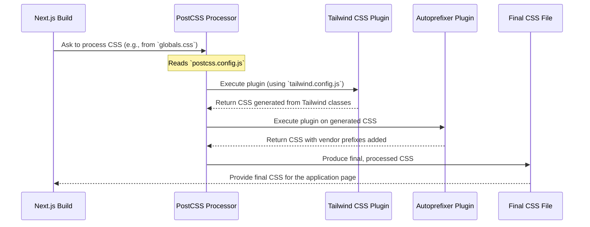

# Chapter 3: CSS Processing Pipeline

Welcome back! In [Chapter 2: Tailwind CSS Styling Configuration](02_tailwind_css_styling_configuration.md), we learned how to define our project's unique look and feel using the `tailwind.config.js` file. We set up custom fonts and even created a cool "blue glow" effect!

But how do those Tailwind class names (`bg-blue-500`, `drop-shadow-blue`) and our configuration settings actually turn into real CSS code that a web browser can understand? And how do we make sure our styles work correctly on different browsers, even older ones? That's where our CSS Processing Pipeline comes in!

## What's the Big Idea? An Assembly Line for Our Styles

Imagine you've designed a beautiful piece of furniture (your styles using Tailwind). Now, you need to actually build it, sand it, paint it, and maybe add some protective coating so it lasts a long time and looks good everywhere.

Our CSS needs a similar process. The Tailwind classes and modern CSS features we write are like the design blueprint. We need an "assembly line" to:

1.  **Build the CSS:** Convert the Tailwind class names we used in our code into actual CSS rules (like `color: blue;`).
2.  **Ensure Compatibility:** Automatically add special prefixes (like `-webkit-` or `-moz-`) to some CSS rules so they work correctly on various web browsers (like Safari, Firefox, Chrome, etc.).

This assembly line is powered by a tool called **PostCSS**.

**Our Goal (Use Case):** Let's say we used the following Tailwind classes in our HTML:

*   `flex`: To arrange items horizontally.
*   `bg-blue-500`: To give an element a blue background (using Tailwind's default blue).
*   `drop-shadow-blue`: Our custom blue glow effect defined in `tailwind.config.js`.

We need a process that automatically transforms these into standard CSS that works everywhere. For example, `flex` might need prefixes like `-webkit-box` for older browsers, and `drop-shadow-blue` needs to be converted into the actual CSS `filter` property we defined.

This chapter shows how we configure PostCSS to handle this transformation automatically.

## Meet the Assembly Line Manager: `postcss.config.js`

PostCSS is a powerful tool that transforms CSS using JavaScript plugins. Think of it as a manager for our style assembly line. We tell it which machines (plugins) to use and in what order.

The configuration file for PostCSS is typically named `postcss.config.js` and lives in the root of our project. It's usually very simple!

Here's the configuration for EnvKeyVault:

```javascript
// File: postcss.config.js

module.exports = {
  plugins: {
    // 1. Run Tailwind CSS
    tailwindcss: {},
    // 2. Add browser prefixes
    autoprefixer: {},
  },
};
```

That's it! Let's understand what these two plugins do.

## Key Plugins Explained

The `plugins` object tells PostCSS which tools to use on our CSS code. In our case, we're using two essential plugins:

### 1. Tailwind CSS (`tailwindcss: {}`)

This plugin is the bridge between PostCSS and Tailwind CSS itself.

```javascript
  plugins: {
    tailwindcss: {}, // Tells PostCSS to use the Tailwind plugin
    // ...
  },
```

*   **What it does:** When PostCSS encounters this plugin, it essentially runs the Tailwind CSS engine. Tailwind will then:
    *   Look at your `tailwind.config.js` file (which we explored in [Chapter 2: Tailwind CSS Styling Configuration](02_tailwind_css_styling_configuration.md)).
    *   Scan the files specified in the `content` section of `tailwind.config.js`.
    *   Find all the Tailwind classes you've used (like `flex`, `bg-blue-500`, `drop-shadow-blue`).
    *   Generate the actual CSS rules for those classes, incorporating your custom theme settings.
*   **Analogy:** Think of this plugin as the "Construction Machine" on our assembly line. It takes the design blueprints (`tailwind.config.js` and your code) and builds the main structure of the furniture (the basic CSS).

### 2. Autoprefixer (`autoprefixer: {}`)

Web browsers sometimes implement new CSS features differently, or they might require special "vendor prefixes" for certain properties while they are experimental or new. Autoprefixer handles this for us automatically.

```javascript
  plugins: {
    // ...
    autoprefixer: {}, // Tells PostCSS to use the Autoprefixer plugin
  },
```

*   **What it does:** This plugin scans the CSS *after* Tailwind has generated it. It looks for CSS properties that might need vendor prefixes for better browser compatibility (like `display: flex`, `transform`, `user-select`, etc.). It uses data from "Can I Use" (a website tracking browser feature support) to add necessary prefixes like `-webkit-`, `-moz-`, `-ms-`.
*   **Example:** If the CSS contains `display: flex;`, Autoprefixer might change it to:
    ```css
    display: -webkit-box; /* Older Safari/Chrome */
    display: -ms-flexbox; /* Internet Explorer 10 */
    display: flex;        /* Standard */
    ```
*   **Analogy:** This plugin is like the "Finishing Station" on our assembly line. It takes the built furniture (the generated CSS) and applies a protective coating (vendor prefixes) to ensure it looks good and works well in different environments (browsers).

## Putting it Together: Solving Our Use Case

How does this `postcss.config.js` file achieve our goal of transforming Tailwind classes into browser-ready CSS?

1.  **Input:** Our build process starts. It finds our main CSS file (often `app/globals.css` or similar), which usually contains directives like `@tailwind base;`, `@tailwind components;`, `@tailwind utilities;`. It also knows about the HTML/JSX files using Tailwind classes like `flex`, `bg-blue-500`, and `drop-shadow-blue`.
2.  **Processing via PostCSS:** The build tool sends the CSS through the PostCSS pipeline defined in `postcss.config.js`.
    *   **Tailwind Plugin Runs:** The `tailwindcss` plugin activates. It scans our code, finds `flex`, `bg-blue-500`, and `drop-shadow-blue`, consults `tailwind.config.js`, and generates the corresponding CSS rules.
        *   `flex` might become `.flex { display: flex; }`
        *   `bg-blue-500` might become `.bg-blue-500 { background-color: #3b82f6; }` (simplified example)
        *   `drop-shadow-blue` becomes `.drop-shadow-blue { filter: drop-shadow(0 10px 15px rgba(59, 130, 246, 0.2)); }` (using our custom definition)
    *   **Autoprefixer Plugin Runs:** The `autoprefixer` plugin takes the CSS generated by Tailwind. It sees `display: flex;` and potentially adds prefixes if needed for the target browsers configured in the project (Next.js usually handles browser targeting automatically). It might also add prefixes for the `filter` property if required.
3.  **Output:** The final result is a single, optimized CSS file containing all the necessary styles, including our custom ones and browser-specific prefixes. This file is ready to be included in our web application.
    *   Example snippets in the final CSS:
        ```css
        /* Generated by Tailwind */
        .bg-blue-500 {
          --tw-bg-opacity: 1; /* Tailwind internal variable */
          background-color: rgb(59 130 246 / var(--tw-bg-opacity));
        }

        /* Generated by Tailwind, potentially prefixed by Autoprefixer */
        .flex {
          display: -webkit-box; /* Added by Autoprefixer */
          display: -ms-flexbox; /* Added by Autoprefixer */
          display: flex;        /* From Tailwind */
        }

        /* Generated by Tailwind from our config */
        .drop-shadow-blue {
           /* Prefixes might be added here too by Autoprefixer if needed */
          filter: drop-shadow(0 10px 15px rgba(59, 130, 246, 0.2));
        }
        ```

This processed CSS is what the browser actually downloads and uses to style the page.

## Under the Hood: How PostCSS Gets Used

You might wonder, "How does PostCSS even run? Do I need to type a special command?" The good news is, frameworks like Next.js often have built-in support for PostCSS.

**The Process (Simplified):**

1.  **Build Starts:** You run `npm run dev` or `npm run build`.
2.  **Next.js Detects CSS:** As Next.js processes your project, it encounters CSS files (like `app/globals.css`) or detects the need to generate CSS.
3.  **PostCSS Config Check:** Next.js automatically looks for a `postcss.config.js` file in your project root.
4.  **Pipeline Execution:** If it finds the config file, Next.js uses PostCSS to process the CSS according to the plugins listed in `postcss.config.js`. It essentially passes the CSS content through each plugin in the specified order.
5.  **Final CSS:** Next.js takes the final, processed CSS output from PostCSS and includes it in the application build, linking it to your HTML pages.

**Visualizing the Process during Build:**



**The Code:**

The elegance here is that the integration is mostly automatic thanks to Next.js. Our only job is to create the `postcss.config.js` file and tell it which plugins we need.

```javascript
// File: postcss.config.js

// This standard JavaScript export makes the configuration available
module.exports = {
  // The 'plugins' object is the key part PostCSS looks for
  plugins: {
    // Each key-value pair enables a plugin.
    // The empty object `{}` means use the plugin with its default settings.
    tailwindcss: {},
    autoprefixer: {},
  },
};
```

Next.js finds this file, understands the `plugins` object, and ensures that PostCSS runs these plugins whenever CSS needs processing during development or the build.

## Conclusion

You've successfully navigated the CSS Processing Pipeline! You learned that:

*   **PostCSS** acts like an assembly line manager for our styles.
*   The `postcss.config.js` file tells PostCSS which tools (plugins) to use.
*   The `tailwindcss` plugin converts our Tailwind classes and configuration into actual CSS.
*   The `autoprefixer` plugin adds browser-specific prefixes to ensure cross-browser compatibility.
*   Frameworks like Next.js automatically integrate PostCSS into the build process, making setup easy.

This pipeline ensures that the stylish designs we defined using Tailwind in [Chapter 2: Tailwind CSS Styling Configuration](02_tailwind_css_styling_configuration.md) are reliably transformed into standard, optimized CSS that works beautifully across different web browsers.

Our application is configured, styled, and processed! But how do we make sure everything is working as expected and catch errors early? That leads us to our next topic: testing.

Ready to ensure our application is robust? Let's move on to [Chapter 4: Testing Environment Setup](04_testing_environment_setup.md).

---

Generated by [AI Codebase Knowledge Builder](https://github.com/The-Pocket/Tutorial-Codebase-Knowledge)