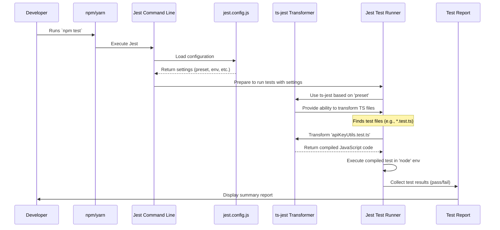

# Chapter 4: Testing Environment Setup

Welcome back! In [Chapter 3: CSS Processing Pipeline](03_css_processing_pipeline.md), we saw how our stylish Tailwind code gets transformed into browser-ready CSS using PostCSS. Our application is now configured, styled, and processed. But how do we ensure all the different parts of our code actually *work* correctly, especially as we add new features or make changes? This is where testing comes in!

## What's the Big Idea? Setting Up Our Quality Control Lab

Imagine you're building something complex, like a robot. Before you switch it on for the first time, you'd want to test individual parts, right? Does the arm motor spin correctly? Does the sensor detect objects? Testing helps catch problems early.

In software development, we write small pieces of code called "tests" to automatically check if our main code (like functions or components) behaves as expected. **Jest** is a popular tool (a "testing framework") that helps us write and run these tests.

But just like a real-world lab needs setup – the right equipment, the right environment – Jest needs configuration. We need to tell it how to handle our project's specific setup.

**Our Goal (Use Case):** Let's say we wrote a simple helper function in TypeScript (a variation of JavaScript that adds type safety) to check if an API key is valid (e.g., it must be a certain length). We want to write a test for this function. How do we tell Jest:
1.  That our code is written in TypeScript and needs special handling?
2.  That our code is designed to run in a server environment (Node.js), not directly in a web browser?

This chapter explains how we configure Jest using its special configuration file to achieve this.

## Meet the Lab Manual: `jest.config.js`

Jest looks for a configuration file, usually named `jest.config.js`, in the root of our project. Think of this file as the **instruction manual for our quality control lab (Jest)**. It tells Jest exactly how to set up and run the tests for our project.

Here's the configuration file for EnvKeyVault:

```javascript
// File: jest.config.js

/** @type {import('ts-jest').JestConfigWithTsJest} */
module.exports = {
  // 1. Specify how to handle TypeScript
  preset: "ts-jest",

  // 2. Define the environment for running tests
  testEnvironment: "node",

  // 3. A small tweak for cleaner tests (optional but good practice)
  injectGlobals: false,
};
```

This file is quite concise, but each setting plays an important role. Let's break them down.

## Key Settings Explained

This configuration file guides Jest on how to prepare for and execute our tests.

### 1. Handling TypeScript Code (`preset: "ts-jest"`)

Our EnvKeyVault project uses TypeScript (.ts or .tsx files) for better code quality. Jest, by default, understands plain JavaScript (.js files). We need to tell it how to handle TypeScript.

```javascript
  // 1. Specify how to handle TypeScript
  preset: "ts-jest",
```

*   **`preset`**: This option tells Jest to use a pre-configured setup.
*   **`"ts-jest"`**: This specific preset configures Jest to work seamlessly with TypeScript. It essentially brings in the necessary tools to compile our TypeScript code into JavaScript *just before* the tests are run, so Jest can understand it.
*   **Analogy:** Imagine your lab equipment (Jest) is designed for standard materials (JavaScript). You have special materials (TypeScript). The `preset: "ts-jest"` is like installing an adapter or a special module ("ts-jest") onto your equipment so it can correctly process the special materials.

### 2. Setting the Test Environment (`testEnvironment: "node"`)

Where will our code eventually run? Some code runs directly in a user's web browser (a "browser" environment), while other code runs on a server (a "Node.js" environment). Our helper functions and backend logic in EnvKeyVault are primarily designed for a Node.js environment. Tests should mimic the environment where the code will actually be used.

```javascript
  // 2. Define the environment for running tests
  testEnvironment: "node",
```

*   **`testEnvironment`**: This setting tells Jest what kind of environment to simulate when running tests.
*   **`"node"`**: This specifies that the tests should run in an environment that behaves like Node.js. This means things like browser-specific features (like the `window` object) won't be available, but Node.js features (like interacting with the file system) might be.
*   **Analogy:** This is like setting the conditions in your lab. Are you testing a submersible robot part? You need a water tank (`browser` environment). Are you testing a server component? You need a standard workshop bench (`node` environment). Setting `testEnvironment: "node"` ensures our tests run under the correct conditions for our server-side code.

### 3. Cleaner Test Globals (`injectGlobals: false`)

By default, Jest automatically makes common testing functions (like `describe`, `it`, `expect`) available globally in your test files without you needing to import them. While convenient, this can sometimes lead to conflicts or make it slightly less clear where these functions come from. Setting `injectGlobals` to `false` changes this behaviour.

```javascript
  // 3. A small tweak for cleaner tests (optional but good practice)
  injectGlobals: false,
```

*   **`injectGlobals: false`**: This tells Jest *not* to automatically put its helper functions (like `test`, `expect`) into the global scope of each test file.
*   **What it means:** If this is `false`, you will need to explicitly import these functions from Jest at the top of your test files, like this:
    ```javascript
    // Example test file (e.g., utils.test.ts)
    import { describe, it, expect } from '@jest/globals'; // Import needed functions

    // ... your tests using describe, it, expect ...
    ```
*   **Analogy:** Think of the lab again. `injectGlobals: true` (the default) is like having every single common tool already laid out on every workbench, whether you need it or not. `injectGlobals: false` is like having a clean workbench, and you explicitly grab only the specific tools (`describe`, `it`, `expect`) you need from the main toolbox (`@jest/globals`) for the current task. It keeps things tidier.
*   **Why?** While slightly more verbose, explicitly importing makes the code clearer about its dependencies and avoids potential naming clashes with other variables.

## Putting it Together: Solving Our Use Case

How does this `jest.config.js` file help us test our TypeScript API key validation function?

1.  **You write a test:** You create a file like `apiKeyUtils.test.ts`. Inside, you import your validation function and the Jest testing functions (because `injectGlobals` is false):
    ```typescript
    // File: src/utils/apiKeyUtils.test.ts
    import { describe, it, expect } from '@jest/globals';
    import { isValidApiKey } from './apiKeyUtils'; // Import the function to test

    describe('isValidApiKey', () => {
      it('should return true for a valid key', () => {
        const result = isValidApiKey('valid-key-12345');
        expect(result).toBe(true); // Check if the result is true
      });

      it('should return false for an invalid key', () => {
        const result = isValidApiKey('short');
        expect(result).toBe(false); // Check if the result is false
      });
    });
    ```
2.  **You run the tests:** You execute a command like `npm test` in your terminal.
3.  **Jest takes over:**
    *   Jest starts up and immediately looks for `jest.config.js`.
    *   It sees `preset: "ts-jest"` and knows it needs to handle `.ts` files. It uses `ts-jest` to convert `apiKeyUtils.test.ts` and `apiKeyUtils.ts` into JavaScript that it can understand.
    *   It sees `testEnvironment: "node"` and sets up a Node.js-like environment for the test to run in.
    *   It respects `injectGlobals: false`, so it relies on the `import` statements in your test file.
    *   Jest then executes the compiled test code. It runs the checks inside the `it(...)` blocks using the `expect(...)` function.
    *   Finally, Jest reports whether all the tests passed or if any failed.

Without this configuration, Jest wouldn't know how to read the TypeScript files (`preset`), might run the test in the wrong type of environment (`testEnvironment`), potentially leading to errors or inaccurate results.

## Under the Hood: How Jest Uses the Config

Let's peek behind the curtain to see the sequence of events when you run your tests.

**The Process (Simplified):**

1.  **You run `npm test`:** This command typically invokes the Jest command-line tool (CLI).
2.  **Jest CLI Starts:** The Jest program begins execution.
3.  **Config Loading:** Jest looks for `jest.config.js` (or other valid Jest configuration files) in your project.
4.  **Reading Settings:** It reads the `module.exports` object from the configuration file.
5.  **Applying Settings:**
    *   It sees `preset: "ts-jest"` and loads the `ts-jest` package, configuring itself to use `ts-jest` for transforming TypeScript files.
    *   It sees `testEnvironment: "node"` and prepares a simulated Node.js environment for each test file.
    *   It notes `injectGlobals: false` and ensures its helper functions aren't automatically added to the global scope.
6.  **Finding Tests:** Jest searches your project for files that look like tests (e.g., files ending in `.test.ts` or `.spec.ts`).
7.  **Transformation:** For each TypeScript test file found (and any TypeScript files it imports), Jest uses `ts-jest` to convert the code to JavaScript in memory.
8.  **Execution:** Jest runs the transformed JavaScript test code within the configured Node.js environment.
9.  **Reporting:** Jest collects the results (pass/fail) from all tests and displays a summary report in your terminal.

**Visualizing the Process:**

Here’s a simplified flow diagram:



**The Code:**

The configuration itself is straightforward. Jest is designed to automatically find and interpret this `jest.config.js` file.

```javascript
// File: jest.config.js

// Standard Node.js way to export configuration
module.exports = {
  // Tells Jest to use ts-jest's pre-configured settings
  preset: "ts-jest",

  // Sets up a Node.js-like environment for tests
  testEnvironment: "node",

  // Prevents Jest functions (describe, it, expect)
  // from being global - requires explicit import
  injectGlobals: false,
};
```

By creating this file and defining these properties, we provide Jest with all the necessary instructions to correctly set up the "lab" and run our TypeScript tests in the right environment.

## Conclusion

Fantastic! You've now learned how EnvKeyVault configures its testing environment using Jest. You saw that:

*   Testing is crucial for ensuring code quality and catching errors early.
*   **Jest** is the testing framework used in this project.
*   The `jest.config.js` file acts as the instruction manual for Jest.
*   Key settings like `preset: "ts-jest"` allow testing TypeScript code.
*   `testEnvironment: "node"` ensures tests run in the correct context (like a server).
*   `injectGlobals: false` promotes cleaner test code by requiring explicit imports.

This configuration ensures that when we write tests for our application's functions and components, they run reliably and accurately, giving us confidence that our code works as intended.

This marks the end of our initial configuration journey through EnvKeyVault! We've covered the Next.js framework, Tailwind styling, the CSS processing pipeline, and now the testing setup. With this foundation, you have a much better understanding of how the core pieces of the project are wired together.

---

Generated by [AI Codebase Knowledge Builder](https://github.com/The-Pocket/Tutorial-Codebase-Knowledge)