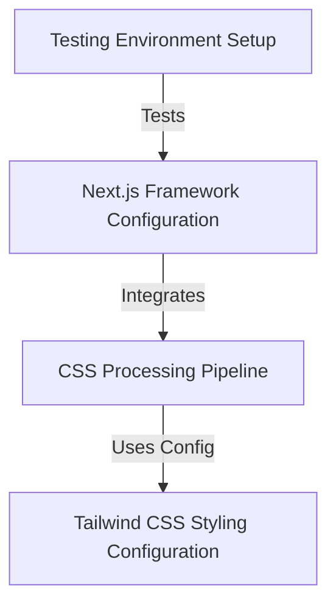

# Tutorial: EnvKeyVault

This project configures a **web application** built with the *Next.js framework*, enabling modern features like the App Directory.
It uses *Tailwind CSS* for styling, defining a custom theme and processing styles via *PostCSS* for browser compatibility.
A *Jest testing environment* is also set up using TypeScript for ensuring code quality.

**Source Repository:** [https://github.com/krishnadeepy/EnvKeyVault](https://github.com/krishnadeepy/EnvKeyVault)

## Chapters

1. [Next.js Framework Configuration](01_next_js_framework_configuration.md)
2. [Tailwind CSS Styling Configuration](02_tailwind_css_styling_configuration.md)
3. [CSS Processing Pipeline](03_css_processing_pipeline.md)
4. [Testing Environment Setup](04_testing_environment_setup.md)

---

Generated by [AI Codebase Knowledge Builder](https://github.com/The-Pocket/Tutorial-Codebase-Knowledge)