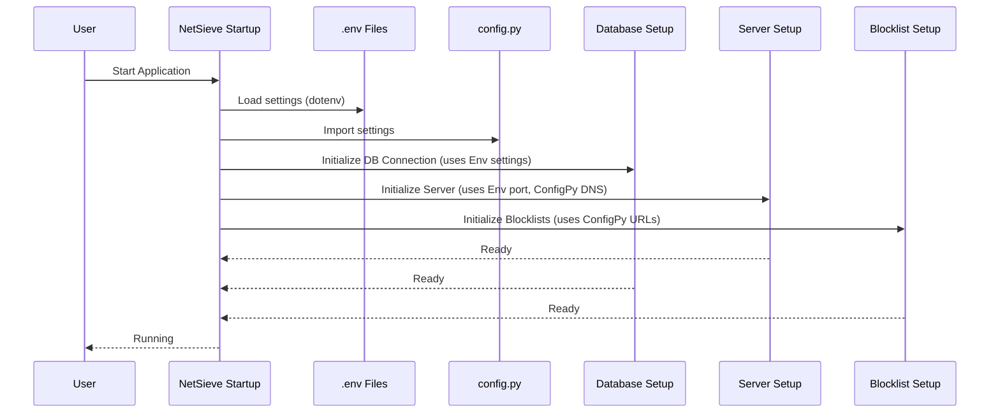

# Chapter 1: System Configuration

Welcome to the NetSieve tutorial! Imagine you just got a new gadget, like a smart speaker. Before you start using it, you probably want to connect it to your Wi-Fi, maybe set your preferred music service, or adjust the volume limits. You're *configuring* it to work the way you want.

NetSieve, our DNS filtering system, also needs some initial setup and ways to adjust its behavior. That's where **System Configuration** comes in.

## What is System Configuration?

Think of System Configuration as the **control panel** or **settings menu** for NetSieve. It's the place where you define *how* NetSieve should operate without changing its core programming.

Just like adjusting knobs or flipping switches on a control panel, you'll edit specific files or settings to tell NetSieve:

1.  **Where to get blocklists:** Which websites provide the lists of domains (like ads or malware sites) that NetSieve should block?
2.  **What to block:** Should it block ads? Gambling sites? Social media? You can enable or disable categories.
3.  **Where to ask for help:** If NetSieve doesn't know the answer to a DNS query (and it's not blocked), which public DNS server (like Cloudflare or Google) should it ask? This is called the "upstream" server.
4.  **How to connect to its memory:** Where is the database located that stores the blocklist information? (This uses special secret settings).
5.  **Which "door" to listen on:** Which network port should the NetSieve DNS server use to receive requests?

Being able to configure these things means you can tailor NetSieve to your specific needs!

## Why Do We Need Configuration?

Imagine if the blocklist URLs or the upstream DNS server were hard-coded directly into the main program. What if a blocklist URL changed? Or what if you preferred Google's DNS over Cloudflare's? You'd have to dig into the core code and change it, which can be risky and complicated.

Configuration separates these *settings* from the *logic*, making NetSieve flexible and easier to manage.

**Use Case:** Let's say you want NetSieve to block ads and malware, but you *don't* want it to block social media websites because you use them frequently. You also prefer using Cloudflare's public DNS (1.1.1.1) as the upstream server. How do you tell NetSieve this? Through its configuration!

## How NetSieve is Configured

NetSieve uses a combination of Python configuration files and environment variables.

**1. The `config.py` File:**

This file (`scripts/config.py`) acts like a primary settings sheet. It's where you define things like blocklist sources and upstream DNS servers.

```python
# File: scripts/config.py

# Blocklist source URLs and categories
URLS = {
    "ADWARE_MALWARE_LINK": {
        "url": 'https://raw.githubusercontent.com/StevenBlack/hosts/master/hosts',
        "enabled": True # Set to False to disable this category
    },
    # ... other categories like FAKE_NEWS, GAMBLING ...
    "SOCIAL": {
        "url": 'https://raw.githubusercontent.com/StevenBlack/hosts/master/alternates/social-only/hosts',
        "enabled": True # Set to False to disable this category
    },
}

# DNS Settings
CLOUDFLARE_DNS = "1.1.1.1" # Default upstream DNS
GOOGLE_DNS = "8.8.8.8"     # Fallback upstream DNS
# ... other settings ...
```

*   **`URLS` Dictionary:** This holds information about different blocklist categories. Each category has a `url` (where to download the list) and an `enabled` flag (`True` or `False`).
*   **`CLOUDFLARE_DNS`, `GOOGLE_DNS`:** These variables store the IP addresses of the public DNS servers NetSieve can use.

**To solve our use case (disable social media blocking):**

You would simply edit `scripts/config.py`:

```python
# File: scripts/config.py (Modified)
# ... inside the URLS dictionary ...
    "SOCIAL": {
        "url": 'https://raw.githubusercontent.com/StevenBlack/hosts/master/alternates/social-only/hosts',
        "enabled": False # Changed from True to False!
    },
# ... rest of the file ...
```

By changing `enabled: True` to `enabled: False` for the "SOCIAL" category, you've told NetSieve not to download or use that blocklist, without touching any other part of the system! The upstream DNS is already set to Cloudflare (`1.1.1.1`) by default in this file.

**2. Environment Variables (`.env` files):**

Some settings, especially sensitive ones like database passwords, or settings that might change depending on *where* you run NetSieve (like the port number), are often stored in special files called `.env` files. These act like secret notes passed to the application.

NetSieve uses files like `.env.prod` (for production database details) and `.env.port` (for the DNS server port).

*Example conceptual content of `.env.prod` (DO NOT store real passwords like this in public):*

```
DATABASE_HOST=your_database_hostname
DATABASE_USER=your_db_user
DATABASE_PASSWORD=super_secret_password
DATABASE_NAME=netsieve_db
```

*Example conceptual content of `.env.port`:*

```
PORT=53
```

The code uses a library (`dotenv`) to load these variables when NetSieve starts.

```python
# File: scripts/models.py (Simplified Snippet)
import os
from dotenv import load_dotenv

# Load variables from .env.prod file
load_dotenv('.env.prod')

# Read database details from environment
DATABASE_HOST = os.getenv("DATABASE_HOST")
DATABASE_USER = os.getenv("DATABASE_USER")
# ... and so on for password and db name
```

This code loads the `.env.prod` file and then uses `os.getenv("VARIABLE_NAME")` to read the values into the program. This keeps sensitive data out of the main codebase. We'll explore how the database is used more in [Chapter 7: Database ORM (HostEntry)](07_database_orm__hostentry_.md).

Similarly, the DNS server port is loaded:

```python
# File: scripts/srv.py (Simplified Snippet)
import os
from dotenv import load_dotenv

# Load the port setting
load_dotenv('.env.port')
DNS_PORT = int(os.getenv("PORT")) # Read the PORT variable

# ... server setup uses DNS_PORT ...
```

This allows you to change the port NetSieve listens on (e.g., from the standard DNS port 53 to a higher port like 5353 if needed) just by editing the `.env.port` file.

## How Configuration Settings Are Used (Under the Hood)

When you start NetSieve, different parts of the application read these configuration settings to set themselves up correctly.

1.  **Startup:** You run the NetSieve application.
2.  **Load Environment:** Key scripts (like `models.py` for database and `srv.py` for the server) use `load_dotenv()` to read the `.env` files.
3.  **Import Config:** Scripts also import values directly from `config.py`. For example, the DNS server part (`srv.py`) imports `CLOUDFLARE_DNS` to know which upstream server to use by default.
4.  **Initialization:** Components initialize based on these loaded values:
    *   The database connection logic uses the `DATABASE_HOST`, `DATABASE_USER`, etc., loaded from the environment.
    *   The blocklist manager checks the `URLS` dictionary in `config.py` to see which lists are `enabled` and where to download them.
    *   The DNS server starts listening on the `DNS_PORT` loaded from the environment.
    *   The DNS resolver part knows to use `CLOUDFLARE_DNS` (from `config.py`) as the primary upstream server.

Here's a simplified diagram showing how settings flow during startup:



This setup ensures that the core logic of handling DNS requests remains separate from the specific details of *your* desired setup.

## Conclusion

System Configuration is the foundation upon which NetSieve operates. By modifying settings in `config.py` and `.env` files, you act as the system administrator, telling NetSieve exactly how you want it to behave – which lists to use, where to forward queries, and how to connect to its resources – all without rewriting the underlying code.

Now that you understand how to configure NetSieve, let's dive into the first major component that uses these settings: the core server itself.

Next up: [Chapter 2: DNS Server Framework](02_dns_server_framework.md)

---

Generated by [AI Codebase Knowledge Builder](https://github.com/The-Pocket/Tutorial-Codebase-Knowledge)