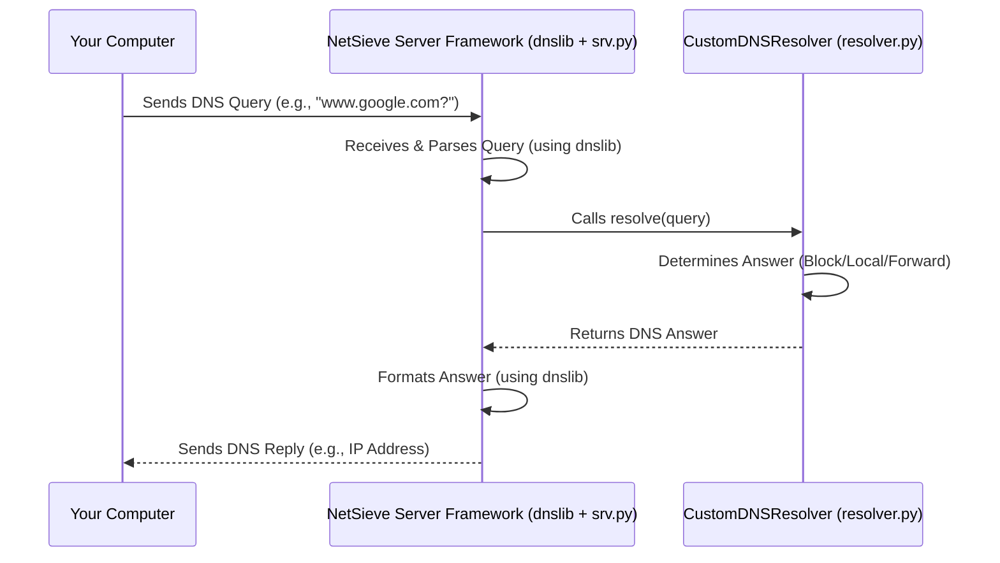

# Chapter 2: DNS Server Framework

In [Chapter 1: System Configuration](01_system_configuration.md), we learned how to adjust NetSieve's settings, like telling it which network "door" (port) to use. But setting the rules is just the first step. Now, we need someone to actually stand at that door, receive incoming requests, and manage the process of getting answers.

That's the job of the **DNS Server Framework**.

## What Does the Server Framework Do?

Imagine a busy post office. You have mail arriving constantly (DNS requests). You need a system to handle this flow: someone to receive the mail, figure out where it needs to go based on sorting rules, and send it on its way.

The DNS Server Framework in NetSieve is like that dedicated **mail sorter and dispatcher**. Its main jobs are:

1.  **Listening:** It patiently waits for incoming DNS requests on the specific network port you configured (like port 53, the standard for DNS).
2.  **Receiving:** When a request arrives (like your computer asking "What's the IP address for `www.google.com`?"), the framework accepts it.
3.  **Orchestrating:** It doesn't figure out the answer itself. Instead, it hands the request over to the "brains" of the operation – the [DNS Query Resolution](03_dns_query_resolution.md) logic – which decides whether to block the request, look up a local record, or ask an upstream server.
4.  **Replying:** Once the resolution logic provides an answer, the framework takes that answer and sends it back to the computer that originally asked the question.

This entire process happens within the `scripts/srv.py` file in the NetSieve project. To handle the technical complexities of the DNS protocol (the specific format of DNS messages), NetSieve uses a helpful Python library called `dnslib`. Think of `dnslib` as providing the standard mailbags, envelopes, and sorting bins – the tools needed to handle DNS messages correctly.

**Use Case:** Let's say you've configured NetSieve to run on your computer. When you type `www.example.com` into your browser, your computer needs to find its IP address. It sends a DNS query to NetSieve. How does NetSieve actually *receive* this query and start processing it? The DNS Server Framework is the component responsible for listening for and accepting that initial query.

## Setting Up the Listening Post

Remember how we set the `PORT` in the `.env.port` file in Chapter 1? The server framework reads this setting to know *where* to listen.

```python
# File: scripts/srv.py (Simplified Snippet)
import os
from dotenv import load_dotenv

# Load the port setting from the .env.port file
load_dotenv('.env.port')
DNS_PORT = int(os.getenv("PORT", 53)) # Read the PORT, default to 53 if not set

# ... rest of the server setup code ...
```

This small piece of code does exactly what we discussed in Chapter 1: it loads the `.env.port` file and reads the value of the `PORT` variable into `DNS_PORT`. This tells the framework which network door number to use. If the variable isn't found, it defaults to 53.

## Starting the Server

The core function that brings the server to life is `start_dns_server`. Let's look at a simplified version:

```python
# File: scripts/srv.py (Simplified Snippet)
from dnslib.server import DNSServer
from config import CLOUDFLARE_DNS # Import upstream DNS from config
# CustomDNSResolver is defined in srv.py, handles query logic
from .resolver import CustomDNSResolver # Assuming resolver logic is moved

# ... (DNS_PORT is loaded as shown before) ...

def start_dns_server(port: int = DNS_PORT):
    """Starts the DNS server."""
    try:
        # 1. Create the 'brain' - the resolver that decides how to answer
        # We'll dive into CustomDNSResolver in the next chapter!
        resolver = CustomDNSResolver(upstream_dns=CLOUDFLARE_DNS)

        # 2. Create the server instance using dnslib
        # Tell it which resolver logic to use, which port to listen on,
        # and which network address to listen on ("0.0.0.0" means listen on all available networks)
        dns_server = DNSServer(
            resolver=resolver,
            port=port,
            address="0.0.0.0" # Listen on all network interfaces
        )

        # 3. Start the server! It begins listening in the background.
        print(f"Starting DNS server on port {port}...")
        dns_server.start_thread() # Runs the server in a separate thread

        # Keep the main program alive while the server runs
        while True:
            time.sleep(1)

    except Exception as e:
        print(f"Error starting server: {e}")
    # ... (error handling and shutdown logic) ...

if __name__ == "__main__":
    start_dns_server() # Call the function to start the server
```

Let's break down the important parts:

1.  **`resolver = CustomDNSResolver(...)`**: This creates an instance of our custom logic class (`CustomDNSResolver`). This is the component that will actually figure out the *answers* to DNS queries. We pass it the upstream DNS server address (like Cloudflare's `1.1.1.1`) which we got from `config.py` (see [Chapter 1: System Configuration](01_system_configuration.md)). We'll explore `CustomDNSResolver` in detail in [Chapter 3: DNS Query Resolution](03_dns_query_resolution.md).
2.  **`dns_server = DNSServer(...)`**: This is where the magic of the `dnslib` library comes in. We create a `DNSServer` object. We tell it:
    *   `resolver=resolver`: Use *our* custom logic (`CustomDNSResolver`) to handle requests.
    *   `port=port`: Listen on the port number we loaded (`DNS_PORT`).
    *   `address="0.0.0.0"`: Listen for requests coming from any network connection on the machine, not just a specific one.
3.  **`dns_server.start_thread()`**: This command tells the `DNSServer` object to actually start listening for incoming DNS requests. It runs in the background (a "thread") so our program can continue doing other things if needed (though in this case, it mainly just waits).
4.  **`if __name__ == "__main__":`**: This standard Python construct means "if this script is run directly, then call `start_dns_server()`". This is how the server is launched when you execute `python scripts/srv.py`.

When you run this script, NetSieve starts listening. It's now ready to receive DNS queries!

## Under the Hood: The Request Cycle

What happens when a DNS query actually arrives?

1.  **Arrival:** Your computer sends a DNS query (e.g., for `www.google.com`) to the IP address of the machine running NetSieve, directed at the port NetSieve is listening on (e.g., port 53).
2.  **Reception (`dnslib`):** The `DNSServer` (from the `dnslib` library) is constantly listening on that port. It receives the raw network data containing the DNS query.
3.  **Parsing (`dnslib`):** `dnslib` understands the DNS protocol. It parses the raw data into a structured `DNSRecord` object that's easy for Python code to work with.
4.  **Hand-off (`srv.py` -> `resolver.py`):** The `DNSServer` takes this parsed `DNSRecord` (the request) and calls the `resolve` method of the `CustomDNSResolver` object we gave it during setup.
5.  **Resolution (`resolver.py`):** The `CustomDNSResolver` does its work (checks blocklists, local records, or forwards the query). We'll cover this in [Chapter 3: DNS Query Resolution](03_dns_query_resolution.md). It eventually creates a `DNSRecord` object containing the *answer*.
6.  **Return (`resolver.py` -> `srv.py`):** The `CustomDNSResolver` returns the answer `DNSRecord` back to the `DNSServer`.
7.  **Formatting (`dnslib`):** The `DNSServer` takes the answer `DNSRecord` and formats it back into the raw network data format required by the DNS protocol.
8.  **Reply (`dnslib`):** The `DNSServer` sends this raw data back over the network to the computer that originally sent the query.

Here's a simplified diagram of that flow:



The key takeaway is that the **DNS Server Framework (`srv.py` using `dnslib`)** acts as the entry point and exit point. It handles the communication logistics, while the **Resolver (`resolver.py`)** handles the decision-making logic.

## Conclusion

The DNS Server Framework is the engine heart of NetSieve. It uses the `dnslib` library to handle the technical details of network communication and the DNS protocol. Its primary role, defined in `srv.py`, is to listen for incoming DNS requests based on the configuration we set, pass them to the appropriate logic for resolution, and send the final response back. It's the essential foundation that allows NetSieve to act as a functioning DNS server.

Now that we understand how the server listens and manages the request-response cycle, let's dive into the "brains" – how NetSieve actually decides *how* to answer those DNS queries.

Next up: [Chapter 3: DNS Query Resolution](03_dns_query_resolution.md)
