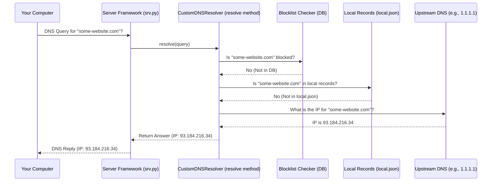
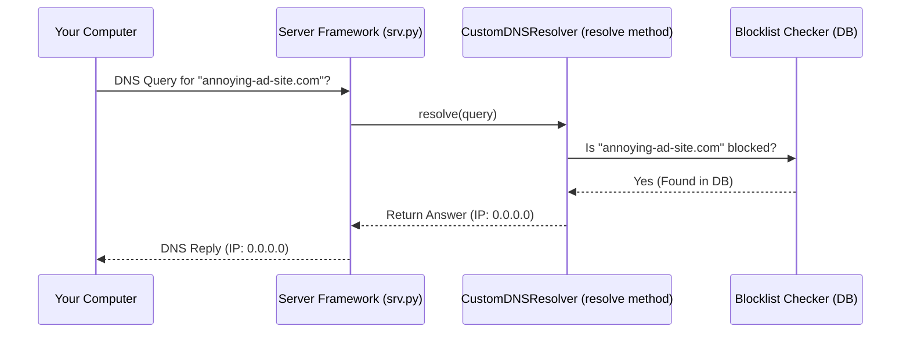
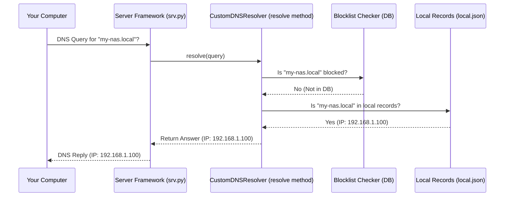

# Chapter 3: DNS Query Resolution

In [Chapter 2: DNS Server Framework](02_dns_server_framework.md), we learned how NetSieve sets up its "listening post" to receive DNS queries. It's like our post office sorter is ready at the counter. But what happens when a letter (a DNS query) actually arrives? How does the sorter decide where it goes?

That's where **DNS Query Resolution** comes in. This is the core decision-making logic of NetSieve.

## What Problem Does This Solve? The Decision Maker

Imagine you're using the internet, and your computer needs the IP address for a website. It sends a DNS query to NetSieve. NetSieve needs a set of rules to decide what to do with that query.

*   **Use Case 1: Blocking:** You try to visit `annoying-ad-site.com`. NetSieve should recognize this as a blocked domain and stop the request.
*   **Use Case 2: Local Network:** You want to access your home file server using a simple name like `my-nas.local`. NetSieve should know the local IP address (e.g., `192.168.1.100`) for this name.
*   **Use Case 3: Regular Website:** You want to visit `www.google.com`. NetSieve doesn't block this and doesn't have a special local rule for it, so it needs to ask a public DNS server for the real IP address.

DNS Query Resolution is the process that handles all these scenarios. It's like a **traffic controller** for DNS requests.

## The Decision Flow: Block, Local, or Forward?

NetSieve follows a specific order of operations for every incoming DNS query. Think of our traffic controller managing an intersection:

1.  **Check the Blocklist (Red Light):** First, the controller checks if the destination (the requested domain name) is on a "Do Not Enter" list (the blocklist stored in the database).
    *   *If YES:* The controller immediately stops the traffic and puts up a "Road Closed" sign (returns the IP address `0.0.0.0`, which basically means "this address doesn't exist"). The process stops here.
2.  **Check Local Overrides (Special Parking Lot):** If the domain is *not* on the blocklist, the controller checks if there's a special local instruction for this destination. Maybe it's a local service or device on your home network.
    *   *If YES:* The controller directs the traffic to a specific local spot (returns the predefined local IP address from your configuration). The process stops here.
3.  **Forward to Upstream (Main Highway):** If the domain is not blocked and there's no special local rule, the controller assumes it's a regular destination out on the public internet.
    *   *Action:* The controller waves the traffic through, directing it to the main highway (forwards the original DNS query to a public "upstream" DNS server like Cloudflare or Google). NetSieve then waits for the answer from the upstream server and passes that answer back to the computer that asked.

This sequence ensures that blocking takes top priority, followed by local network overrides, and finally, regular internet lookups.

## How NetSieve Implements This: The `CustomDNSResolver`

This decision logic lives inside the `CustomDNSResolver` class, primarily within its `resolve` method located in the `scripts/srv.py` file. Remember from Chapter 2, the `DNSServer` framework receives the query and hands it off to this `resolve` method.

Let's look at a simplified version of the `resolve` method to see the decision flow in action:

```python
# File: scripts/srv.py (Simplified inside CustomDNSResolver class)

# (Other parts of the class like __init__ are omitted for clarity)

def resolve(self, request, handler):
    """Resolve DNS requests based on blocklist, local records, or upstream."""

    # Get the requested domain name (e.g., "www.google.com")
    hostname = str(request.q.qname).rstrip('.')
    logger.info(f"Processing query for: {hostname}") # Log the request

    # 1. Check Blocklist (using the database checker)
    # self.block_checker asks the database: "Is this hostname blocked?"
    # We'll see how the blocklist works in Chapter 4 & 7.
    if self.block_checker.match(request.q.qname):
        logger.info(f"Blocking: {hostname}")
        reply = request.reply() # Create an empty reply
        # Add an answer saying the IP is 0.0.0.0
        reply.add_answer(RR(request.q.qname, QTYPE.A, rdata=dns.A("0.0.0.0"), ttl=300))
        return reply # Send the "blocked" reply back

    # 2. Check Local Overrides (using pre-loaded local records)
    # self.local_records is a dictionary loaded from local.json
    # We'll learn more about this in Chapter 5.
    if hostname in self.local_records:
        logger.info(f"Local override found for: {hostname}")
        reply = request.reply()
        local_ip = self.local_records[hostname]['ip'] # Get the local IP
        # Add an answer with the configured local IP
        reply.add_answer(RR(request.q.qname, QTYPE.A, rdata=A(local_ip), ttl=300))
        return reply # Send the "local" reply back

    # 3. Forward to Upstream (if not blocked and no local override)
    # If we reach here, we need to ask an external server.
    logger.info(f"Forwarding query for: {hostname}")
    # This part handles the actual sending/receiving from upstream DNS.
    # We'll dive into this in Chapter 6.
    try:
        # Conceptual: Ask the upstream server (e.g., 1.1.1.1)
        response = self.forward_to_upstream(request)
        return response # Send the upstream server's reply back
    except Exception as e:
        logger.error(f"Failed to forward query for {hostname}: {e}")
        # If forwarding fails, send an error reply
        reply = request.reply()
        reply.header.rcode = RCODE.SERVFAIL # Server Failure error code
        return reply
```

**Explanation:**

1.  **`hostname = str(request.q.qname).rstrip('.')`**: Extracts the plain domain name from the incoming `request`.
2.  **`if self.block_checker.match(...)`**: This calls a helper (`self.block_checker`) which internally checks the database (more on this in [Chapter 4: Blocklist Data Management](04_blocklist_data_management.md) and [Chapter 7: Database ORM (HostEntry)](07_database_orm__hostentry_.md)). If `match` returns `True`, it means the domain is blocked.
3.  **`reply.add_answer(...)` for Blocked**: If blocked, it creates a DNS answer record (`RR`) of type `A` (an IPv4 address) pointing to `0.0.0.0` and returns it.
4.  **`if hostname in self.local_records:`**: If not blocked, it checks if the hostname exists as a key in the `self.local_records` dictionary (which was loaded from `local.json` - see [Chapter 5: Local DNS Records](05_local_dns_records.md)).
5.  **`reply.add_answer(...)` for Local**: If a local record is found, it gets the corresponding IP address (`local_ip`) and creates an `A` record reply pointing to that IP.
6.  **`self.forward_to_upstream(request)`**: If the domain wasn't blocked and wasn't found in local records, this conceptual function (representing the forwarding logic detailed in [Chapter 6: Upstream DNS Forwarding](06_upstream_dns_forwarding.md)) is called to ask the configured upstream DNS server.
7.  **`return response`**: The response received from the upstream server is returned directly.
8.  **Error Handling**: If forwarding fails for some reason (e.g., network issue), it sends back a generic "Server Failure" error (`SERVFAIL`).

## Under the Hood: The Decision Journey

Let's visualize the step-by-step process when a query for `some-website.com` arrives:



If the query was for `annoying-ad-site.com` (which is blocked):



If the query was for `my-nas.local` (which has a local override):



This clear, prioritized decision path is the core of NetSieve's filtering and customization capabilities.

## Conclusion

DNS Query Resolution is the "brain" of NetSieve, implemented in the `resolve` method of the `CustomDNSResolver`. It acts like a traffic controller, examining each incoming DNS request and deciding its fate based on a clear set of rules:

1.  Is it **blocked**? (Stop sign)
2.  Is there a **local override**? (Special parking)
3.  Otherwise, **forward** it. (Main highway)

This logic allows NetSieve to protect your network by blocking unwanted domains, provide easy access to local devices, and still let you reach the rest of the internet seamlessly.

We've seen *that* NetSieve checks a blocklist, but *how* does it manage that list? Where does the data come from, and how is it stored efficiently? Let's explore that next.

Next up: [Chapter 4: Blocklist Data Management](04_blocklist_data_management.md)
