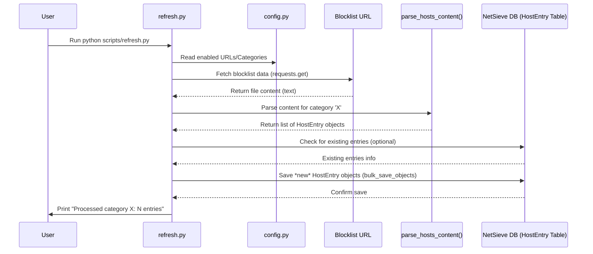

# Chapter 4: Blocklist Data Management

In [Chapter 3: DNS Query Resolution](03_dns_query_resolution.md), we saw how NetSieve acts like a traffic controller, deciding whether to block a request, use a local rule, or forward it. A crucial part of that decision was checking if a domain was on the **blocklist**. But how does NetSieve build and maintain that blocklist in the first place?

That's the job of **Blocklist Data Management**.

## What Problem Does This Solve? Keeping the Blocklist Fresh

Imagine you're a security guard at a building entrance. You have a list of people who aren't allowed in. To do your job effectively, you need:

1.  **A source for the list:** Where do you get the names of banned individuals? (Maybe from building management or security alerts).
2.  **A way to read the list:** Can you understand the format it's written in?
3.  **A place to keep the list:** Do you memorize it, or write it down in an organized notebook?
4.  **A way to update the list:** What happens when new people are banned or restrictions are lifted?

Blocklist Data Management solves these problems for NetSieve. It handles getting the lists of domains to block, understanding them, storing them efficiently, and keeping them up-to-date.

**Use Case:** You want NetSieve to block known advertising domains. You've told NetSieve *where* to find a list of these domains (in [Chapter 1: System Configuration](01_system_configuration.md)). Now, how does NetSieve actually fetch that list, extract the domains like `annoying-ad-site.com`, and store them so the DNS resolver in Chapter 3 can quickly check against them? Blocklist Data Management takes care of this entire process.

## The Librarian Analogy

Think of Blocklist Data Management like a **librarian** for NetSieve:

1.  **Subscribing to Journals (Acquiring):** The librarian subscribes to different online journals or feeds (`config.py` URLs) that publish lists of "bad" domains (like ads, malware sites, etc.).
2.  **Reading Articles (Parsing):** When a new issue arrives (the downloaded list), the librarian reads it carefully, looking for specific pieces of information – the actual domain names to be blocked.
3.  **Cataloging Books (Storing):** The librarian takes each identified domain name and catalogs it neatly on shelves (stores it in the database), possibly marking which journal (category) it came from.
4.  **Checking for New Issues (Updating):** Periodically, the librarian checks if new issues of the subscribed journals are available to ensure the catalog stays current (running the `refresh.py` script).

## The Process: From URL to Database

NetSieve uses a dedicated script, `scripts/refresh.py`, to act as our librarian. Here's how it works:

1.  **Identify Sources:** The script first looks at the `config.py` file (which we saw in [Chapter 1: System Configuration](01_system_configuration.md)) to see which blocklist categories are `enabled` and what their `url` is.

    ```python
    # File: scripts/config.py (Snippet)
    URLS = {
        "ADWARE_MALWARE_LINK": {
            "url": 'https://raw.githubusercontent.com/StevenBlack/hosts/master/hosts',
            "enabled": True # <-- The script checks this!
        },
        "SOCIAL": {
            "url": 'https://raw.githubusercontent.com/StevenBlack/hosts/master/alternates/social-only/hosts',
            "enabled": False # <-- This category will be skipped
        },
        # ... other categories ...
    }
    ```
    This tells the script which "journals" to subscribe to.

2.  **Fetch Data:** For each *enabled* category, the script downloads the content from the specified `url`. This is usually a text file in a format called a "hosts file".

    *Example Hosts File Content (Simplified):*
    ```
    # This is a comment
    127.0.0.1 localhost
    0.0.0.0 annoying-ad-site.com
    0.0.0.0 another-bad-tracker.net # Optional comment
    # 0.0.0.0 some-other-site.org <-- This line is commented out
    0.0.0.0 malware-domain.co
    ```

3.  **Parse Data:** The script reads the downloaded text file line by line. It ignores comments (`#`) and blank lines. For valid lines, it typically looks for lines starting with `0.0.0.0` or `127.0.0.1` (common indicators in blocklists) and extracts the domain name that follows.

    ```python
    # File: scripts/refresh.py (Simplified Parsing Logic)
    def parse_hosts_content(content, category):
        hosts = []
        for line in content.splitlines():
            line = line.strip()
            # Skip comments and empty lines
            if line.startswith('#') or not line:
                continue
            parts = line.split() # Split line by spaces
            # Check if it looks like a blocklist entry
            if len(parts) >= 2 and (parts[0] == "0.0.0.0" or parts[0] == "127.0.0.1"):
                ip = parts[0]
                hostname = parts[1] # Get the domain name
                # Add to our list (as a structured object)
                hosts.append(HostEntry(ip=ip, hostname=hostname, category=category))
        return hosts
    ```
    This function takes the raw text (`content`) and the `category` name, and returns a list of structured `HostEntry` objects, each containing the IP, hostname, and category.

4.  **Store Data:** The script takes the extracted domain names (along with the IP address from the list, usually `0.0.0.0`, and the category name) and saves them into NetSieve's database. This uses the `HostEntry` model and `SessionLocal` we'll explore more in [Chapter 7: Database ORM (HostEntry)](07_database_orm__hostentry_.md).

    ```python
    # File: scripts/refresh.py (Simplified Storing Logic)
    from models import HostEntry, SessionLocal # Import DB tools

    def save_hosts_to_db(hosts_to_save):
        with SessionLocal() as db: # Get a database connection
            # Efficiently save all the new host entries
            db.bulk_save_objects(hosts_to_save)
            db.commit() # Finalize the changes
    ```
    This code efficiently saves the list of `HostEntry` objects generated by the parser into the database.

## Running the Librarian: The `refresh.py` Script

To tell the librarian to go check for new journal issues and update the catalog, you run the `refresh.py` script from your terminal:

```bash
python scripts/refresh.py
```

When you run this, you'll see output like:

```
Processed category ADWARE_MALWARE_LINK: 50000 host entries
Processed category FAKE_NEWS: 2500 host entries
Processed category GAMBLING: 3000 host entries
# ... and so on for other enabled categories
```

This output tells you how many *new* entries were added to the database for each category during that run. The script is designed to avoid adding duplicate entries if you run it multiple times.

You would typically run this script periodically (e.g., once a day or week) to keep your blocklists fresh, as the online sources update their lists over time.

## Under the Hood: The Refresh Flow

Let's trace what happens when you run `python scripts/refresh.py`:

1.  **Start:** The `refresh.py` script begins execution.
2.  **Read Config:** It imports the `URLS` dictionary from `config.py`.
3.  **Filter Enabled:** It creates a list of only the categories marked `enabled: True`.
4.  **Loop Categories:** It goes through each enabled category one by one.
5.  **Fetch:** For the current category, it uses the `requests` library to download the content from the associated `url`.
6.  **Parse:** It calls the `parse_hosts_content` function to process the downloaded text and extract domain names into `HostEntry` objects.
7.  **Check Existing (Optional but good practice):** Before saving, it might quickly check the database to see which of the parsed domains are *already* stored for that category to avoid duplicates (as shown in the full `refresh.py` code).
8.  **Store:** It uses `SessionLocal` and `db.bulk_save_objects` (from `models.py` / SQLAlchemy - see [Chapter 7: Database ORM (HostEntry)](07_database_orm__hostentry_.md)) to save the *new* `HostEntry` objects to the database table (`host_entries`).
9.  **Report:** It prints a message indicating how many new entries were added for that category.
10. **Repeat:** It moves to the next enabled category until all are processed.
11. **Finish:** The script exits.

Here’s a diagram visualizing the process for one category:



This structured process ensures that NetSieve can reliably acquire, understand, and store blocklist information from various sources, making it available for the DNS resolver (Chapter 3) to use when filtering requests.

## Conclusion

Blocklist Data Management is the essential "librarian" task within NetSieve. It uses the `refresh.py` script to:

*   Find blocklist sources defined in the configuration.
*   Fetch the latest lists from the internet.
*   Parse these lists to extract domain names.
*   Store the domains neatly categorized in the database.

This ensures that the [DNS Query Resolution](03_dns_query_resolution.md) logic always has an up-to-date and organized list to check against when deciding whether to block a domain. Running `refresh.py` periodically keeps NetSieve's protective shield strong.

Now that we know how NetSieve manages external blocklists, what about defining *your own* custom rules for devices on your local network?

Next up: [Chapter 5: Local DNS Records](05_local_dns_records.md)
