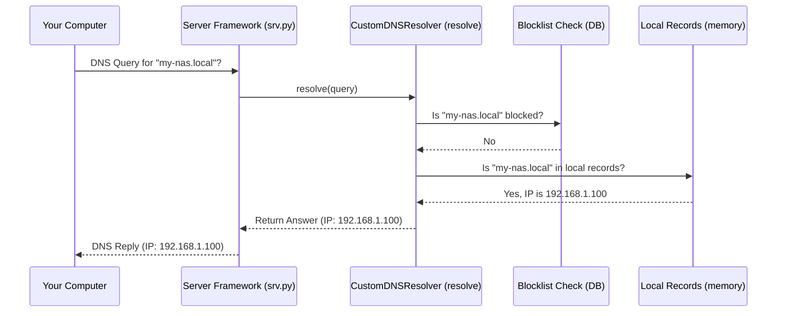

# Chapter 5: Local DNS Records

In [Chapter 4: Blocklist Data Management](04_blocklist_data_management.md), we learned how NetSieve acts like a diligent librarian, keeping its list of blocked websites up-to-date. That's great for blocking unwanted stuff from the *outside* world. But what about things on your *own* network? Or what if you need to make a specific website point to a different address only for your network?

This is where **Local DNS Records** come in handy.

## What Problem Does This Solve? Your Private Address Book

Imagine you have devices on your home network, like a printer (`my-printer.local`) or a Network Attached Storage device (`my-nas.local`). Remembering their IP addresses (like `192.168.1.50` or `192.168.1.100`) can be annoying. Wouldn't it be easier to just use their names?

Public DNS servers (like Google's 8.8.8.8) have no idea about your private devices. They only know about public websites. You need a way to tell NetSieve, "Hey, if someone asks for `my-nas.local`, tell them its IP address is `192.168.1.100`."

**Use Case:** You want to easily access your home file server by typing `http://my-nas.local` in your browser instead of `http://192.168.1.100`. How do you teach NetSieve this specific, private name-to-address mapping?

Local DNS Records provide the solution by acting like a **personal, private address book** for NetSieve.

## The Personal Address Book Analogy

Think of the regular DNS system like the giant, public phone book for the entire internet. Blocklists (Chapter 4) are like sticky notes saying "Don't call these numbers!".

**Local DNS Records** are like your *personal address book* that you keep at home. It contains special phone numbers (IP addresses) for names (`my-nas.local`) that only you care about.

When NetSieve gets a request, it follows this order (as we saw in [Chapter 3: DNS Query Resolution](03_dns_query_resolution.md)):

1.  Check the "Don't Call" list (Blocklist). If it's there, stop.
2.  **Check your Personal Address Book (Local DNS Records).** If the name is in your book, use that number and stop.
3.  If it's not blocked and not in your personal book, look it up in the Public Phone Book (Forward to Upstream DNS).

This ensures your local definitions take priority over public lookups but are still subject to the main blocklist.

## How to Use It: The `local.json` File

NetSieve stores your personal address book in a simple text file named `local.json` located in the main project directory. This file uses a format called JSON (JavaScript Object Notation), which is easy for both humans and computers to read.

Here's what the `local.json` file might look like to solve our use case (mapping `my-nas.local` to `192.168.1.100`):

```json
{
  "records": [
    {
      "name": "my-nas.local",
      "ip": "192.168.1.100"
    },
    {
      "name": "my-printer.local",
      "ip": "192.168.1.50",
      "port": 9100 
    },
    {
      "name": "test-site.dev",
      "ip": "127.0.0.1" 
    }
  ]
}
```

**Explanation:**

*   `{ ... }`: The whole file is enclosed in curly braces, representing a JSON object.
*   `"records": [ ... ]`: It contains a list (or "array") named `"records"`.
*   Each `{ ... }` inside the `records` list represents one local DNS entry.
*   `"name": "my-nas.local"`: This is the custom domain name you want to define.
*   `"ip": "192.168.1.100"`: This is the IP address that the `name` should point to.
*   `"port": 9100` (Optional): You can optionally include other information like a port number, though NetSieve's core DNS function primarily uses the `ip`.
*   You can add multiple records inside the `[...]` list, separated by commas. In the example, we also defined `my-printer.local` and a `test-site.dev` pointing to the local machine (`127.0.0.1`).

**To solve our use case:** Simply create or edit the `local.json` file in the NetSieve project directory and add the entry for `my-nas.local` as shown above. Save the file. You might need to restart NetSieve for it to pick up the changes.

Now, when a device on your network asks NetSieve for the IP of `my-nas.local`, NetSieve will check its personal address book (`local.json`) and reply with `192.168.1.100`.

## How NetSieve Uses `local.json` (Under the Hood)

When NetSieve starts up, the `CustomDNSResolver` (the brain we met in [Chapter 3: DNS Query Resolution](03_dns_query_resolution.md)) reads this `local.json` file and stores the records in memory for quick access.

**1. Loading the File:**

This happens inside the `__init__` method (the initializer or setup function) of the `CustomDNSResolver` class in `scripts/srv.py`.

```python
# File: scripts/srv.py (Simplified inside CustomDNSResolver __init__)
import json
# ... other imports ...

class CustomDNSResolver(LibBaseResolver):
    def __init__(self, upstream_dns: str = DEFAULT_DNS):
        # ... other setup (like block_checker) ...
        self.upstream_dns = upstream_dns
        logger.info(f"Initializing resolver...")

        self.local_records = {} # Create an empty dictionary to store records
        try:
            # Try to open and read the local.json file
            with open('local.json', 'r') as file:
                data = json.load(file) # Parse the JSON data
                # Loop through each record found in the file
                for record in data.get('records', []):
                    name = record.get('name')
                    if name:
                        # Store the record details using the name as the key
                        self.local_records[name] = {
                            'ip': record.get('ip'),
                            'port': record.get('port') # Store port too, if present
                        }
            logger.info(f"Loaded {len(self.local_records)} local records.")
        except FileNotFoundError:
            logger.warning("local.json not found, no local records loaded.")
        except json.JSONDecodeError:
            logger.error("Error parsing local.json, check its format.")
```

**Explanation:**

*   `self.local_records = {}`: An empty Python dictionary (like a filing cabinet) is created to hold the local records.
*   `with open('local.json', 'r') as file:`: Tries to open the `local.json` file for reading.
*   `data = json.load(file)`: Uses Python's `json` library to read the file content and understand its structure.
*   `for record in data.get('records', []):`: It looks for the `"records"` list inside the loaded data. If it finds it, it loops through each entry.
*   `self.local_records[name] = { ... }`: For each entry, it extracts the `name` and `ip` (and optionally `port`) and stores them in the `self.local_records` dictionary. The domain name (`name`) becomes the key for easy lookup later.
*   Error Handling: It includes `try...except` blocks to gracefully handle cases where the file doesn't exist or is incorrectly formatted.

**2. Checking the Records During Resolution:**

Now that the records are loaded into memory (`self.local_records`), the `resolve` method (which handles incoming queries) can check this "personal address book" very quickly.

Remember the `resolve` method flow from [Chapter 3: DNS Query Resolution](03_dns_query_resolution.md)? It checks the blocklist first, *then* checks local records, and only then forwards to upstream.

```python
# File: scripts/srv.py (Simplified inside CustomDNSResolver resolve method)
# ... other imports ...
from dnslib import RR, QTYPE, A # Import tools for creating DNS answers

def resolve(self, request, handler):
    hostname = str(request.q.qname).rstrip('.') # Get requested name

    # 1. Check Blocklist (Code omitted for brevity)
    if self.block_checker.match(request.q.qname):
        logger.info(f"Blocking: {hostname}")
        # ... return blocked response ...
        # return reply 

    # ===> 2. Check Local Records <===
    # Is the requested hostname in our loaded dictionary?
    if hostname in self.local_records:
        logger.info(f"Local override found for: {hostname}")
        reply = request.reply() # Create a reply based on the request
        local_ip = self.local_records[hostname]['ip'] # Get the IP from our records
        # Add an Answer Record (RR) of type A (IPv4 address)
        reply.add_answer(RR(
            rname=request.q.qname, # For the requested name
            rtype=QTYPE.A,         # Type A record (IPv4)
            rdata=A(local_ip),     # The IP address from local.json
            ttl=300                # Time-to-live (how long caches should keep it)
        ))
        return reply # Send the local answer back immediately

    # 3. Forward to Upstream (Code omitted for brevity)
    logger.info(f"Forwarding query for: {hostname}")
    # ... forward request to self.upstream_dns ...
    # return response
```

**Explanation:**

*   After checking the blocklist (Step 1), the code proceeds to Step 2.
*   `if hostname in self.local_records:`: This is the crucial check. It quickly looks up the requested `hostname` in the `self.local_records` dictionary (our loaded address book).
*   If the hostname *is* found (it's a key in the dictionary):
    *   It logs that a local override was found.
    *   It retrieves the corresponding `ip` address stored for that hostname.
    *   `reply.add_answer(...)`: It constructs a DNS answer record (`RR`) containing the local IP address.
    *   `return reply`: It sends this custom answer back to the device that asked, and the process stops here. The upstream DNS server is never contacted for this request.
*   If the hostname is *not* found in `self.local_records`, this `if` block is skipped, and the code proceeds to Step 3 (Forwarding).

**Sequence Diagram: Query for `my-nas.local`**

This diagram shows what happens when your computer asks for `my-nas.local`, assuming it's defined in `local.json` and not blocked:



As you can see, the check for local records happens right after the blocklist check. If a match is found, the answer is returned directly, bypassing the need to ask any external servers.

## Conclusion

Local DNS Records provide a powerful way to customize NetSieve's behavior for your specific network needs. By editing the simple `local.json` file, you can:

*   Give easy-to-remember names to local devices (like `my-nas.local`).
*   Override the public IP address for specific domains, perhaps for development or testing.
*   Create shortcuts on your network.

NetSieve loads these records at startup and checks them *after* the blocklist but *before* contacting external DNS servers, ensuring your local definitions are prioritized correctly. This feature acts as your personal, private address book integrated directly into your DNS filtering.

Now that we understand blocking and local overrides, what happens when a request is neither blocked nor local? NetSieve needs to ask the public internet for the answer. How does it do that?

Next up: [Chapter 6: Upstream DNS Forwarding](06_upstream_dns_forwarding.md)

---

Generated by [AI Codebase Knowledge Builder](https://github.com/The-Pocket/Tutorial-Codebase-Knowledge)