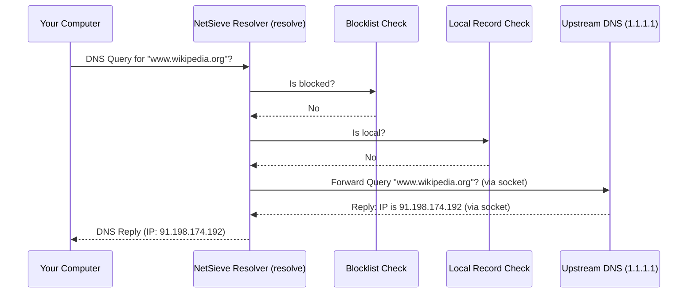
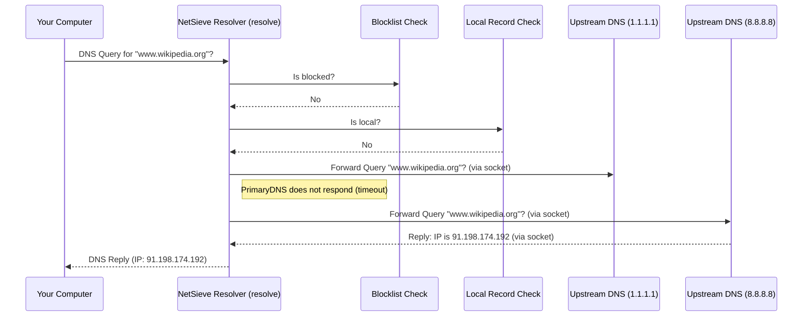

# Chapter 6: Upstream DNS Forwarding

In [Chapter 5: Local DNS Records](05_local_dns_records.md), we learned how to create a "personal address book" for NetSieve using `local.json`, allowing us to define custom names for devices on our network. And in [Chapter 3: DNS Query Resolution](03_dns_query_resolution.md), we saw NetSieve's decision process: check the blocklist first, then check local records.

But what happens when you want to visit a regular website, like `www.wikipedia.org`? NetSieve probably doesn't have it on a blocklist, and it's definitely not in your `local.json` file. How does NetSieve find the correct IP address so your browser can connect?

This is where **Upstream DNS Forwarding** comes into play.

## What Problem Does This Solve? Asking the Experts

Imagine NetSieve as a helpful librarian at a small, specialized library. This library has two main sections:
1.  A list of "Banned Books" (the blocklist).
2.  A small collection of "Local Maps & Guides" (`local.json`).

When you ask the librarian for information (a DNS query):
*   They first check if it's on the "Banned Books" list. If yes, they tell you it's unavailable (`0.0.0.0`).
*   If not banned, they check the "Local Maps & Guides". If found, they give you that specific local information.

**Use Case:** You type `www.wikipedia.org` into your browser. Your computer asks NetSieve for the IP address.
*   NetSieve checks its blocklist – nope, not banned.
*   NetSieve checks its local records (`local.json`) – nope, not there either.

What now? The librarian doesn't have the information in *their* library. They need to consult a bigger, public library system!

**Upstream DNS Forwarding** is the mechanism NetSieve uses to ask these bigger, public DNS "libraries" (called **Upstream DNS Servers**) for the answer when it doesn't know it locally. It ensures that even though NetSieve is filtering requests, you can still access legitimate websites on the internet.

## Key Concepts: Forwarding Explained

1.  **Upstream DNS Servers:** These are large, public DNS servers operated by organizations like Cloudflare (`1.1.1.1`), Google (`8.8.8.8`), or Quad9 (`9.9.9.9`). They have massive databases mapping billions of domain names to their IP addresses. Think of them as the major public libraries or the experts. NetSieve needs the address of at least one of these to function for general internet access.

2.  **The Forwarding Process:** When NetSieve receives a query it can't answer locally (not blocked, not in `local.json`), it temporarily switches roles. Instead of acting as a *server*, it acts as a DNS *client*. It takes the original query and sends it to its designated Upstream DNS Server. It's like our librarian phoning up the main public library to ask them for the information.

3.  **Waiting for the Answer:** After forwarding the query, NetSieve waits for the upstream server to reply with the answer (the IP address).

4.  **Relaying the Answer:** Once NetSieve gets the answer from the upstream server, it passes that exact answer back to the original device (your computer) that asked the question. The librarian tells you the information they got from the public library.

5.  **Fallback Logic (Reliability):** What if the main public library's phone line is busy (the primary upstream server is down or slow)? NetSieve is smart enough to have a backup number! It will try a secondary, or **fallback**, upstream DNS server (like Google's `8.8.8.8` if the primary was Cloudflare's `1.1.1.1`). This ensures that your internet doesn't break just because one upstream server has a temporary problem.

## How NetSieve Forwards Queries

The logic for forwarding lives within the `resolve` method of the `CustomDNSResolver` class in `scripts/srv.py`, the same place where blocklist and local record checks happen.

Remember the configuration from [Chapter 1: System Configuration](01_system_configuration.md)? We defined the upstream servers there, often in `config.py` or directly in `srv.py`.

```python
# File: scripts/srv.py (Constants near the top)

# Use well-known public DNS servers
DEFAULT_DNS = "1.1.1.1"  # Cloudflare (Primary)
FALLBACK_DNS = "8.8.8.8" # Google (Backup)
```

These constants (`DEFAULT_DNS`, `FALLBACK_DNS`) store the IP addresses of the upstream servers NetSieve will use. The `CustomDNSResolver` keeps track of these.

Now, let's look at the simplified `resolve` method again, focusing on the forwarding part (Step 3):

```python
# File: scripts/srv.py (Simplified inside CustomDNSResolver resolve method)
import socket # Library for network communication
from dnslib import DNSRecord, RCODE # DNS tools

# (Constants DEFAULT_DNS and FALLBACK_DNS defined above)

# Inside the resolve method...
def resolve(self, request, handler):
    hostname = str(request.q.qname).rstrip('.')

    # 1. Check Blocklist (omitted)
    # if blocked: return blocked_reply

    # 2. Check Local Records (omitted)
    # if local: return local_reply

    # ===> 3. Forward to Upstream <===
    logger.info(f"Forwarding query for {hostname}")
    # List of servers to try: Primary first, then Fallback
    dns_servers = [(self.upstream_dns, 53), (FALLBACK_DNS, 53)] # Port 53 is standard DNS port

    for server_ip, server_port in dns_servers:
        logger.info(f"Trying upstream server: {server_ip}")
        try:
            # Act as a client: send the query to the upstream server
            # (Simplified representation of socket operations)
            sock = socket.socket(socket.AF_INET, socket.SOCK_DGRAM) # Setup communication channel
            sock.settimeout(3) # Wait max 3 seconds for a reply
            sock.sendto(request.pack(), (server_ip, server_port)) # Send the query
            response_data, _ = sock.recvfrom(4096) # Receive the answer
            sock.close() # Close the channel

            # Parse the raw answer and return it
            response = DNSRecord.parse(response_data)
            logger.info(f"Received answer from {server_ip} for {hostname}")
            return response # <--- Success! Return the upstream answer

        except (socket.timeout, socket.error) as e:
            # If this server failed (timeout or other error), log it and try the next one
            logger.warning(f"Failed to get reply from {server_ip}: {e}")
            continue # Go to the next server in the 'for' loop

    # If the loop finishes without returning, it means all servers failed
    logger.error(f"All upstream DNS servers failed for query: {hostname}")
    reply = request.reply() # Create an error reply
    reply.header.rcode = RCODE.SERVFAIL # Standard "Server Failure" code
    return reply # Return the error reply
```

**Explanation:**

1.  **`dns_servers = [...]`**: Creates a list containing the primary (`self.upstream_dns`, which is `DEFAULT_DNS`) and fallback (`FALLBACK_DNS`) server addresses, paired with the standard DNS port `53`.
2.  **`for server_ip, server_port in dns_servers:`**: The code loops through this list. It will try the primary server first.
3.  **`try...except` Block:** This attempts the communication with the current server.
4.  **Socket Operations:** Using Python's `socket` library, NetSieve:
    *   Opens a network communication channel (`socket.socket`).
    *   Sets a timeout (`sock.settimeout`) – if the server doesn't reply within 3 seconds, give up on *this* server.
    *   Packs the original DNS `request` into the right format (`request.pack()`) and sends it (`sock.sendto`) to the current upstream server's IP and port.
    *   Waits to receive (`sock.recvfrom`) the response data.
    *   Closes the channel (`sock.close`).
5.  **`response = DNSRecord.parse(...)`**: If data is received, `dnslib` parses the raw network data back into a structured `DNSRecord` object (the answer).
6.  **`return response`**: If successful, the code immediately returns the answer received from the upstream server. The loop stops.
7.  **`except (socket.timeout, socket.error)`**: If `sendto` or `recvfrom` fails (e.g., the server doesn't respond in time, causing a `socket.timeout`), the code inside the `except` block runs.
8.  **`logger.warning(...)` & `continue`**: It logs a warning that the current server failed and the `continue` statement jumps to the next iteration of the `for` loop, trying the fallback server.
9.  **Failure (`RCODE.SERVFAIL`)**: If the loop finishes (meaning both primary and fallback servers failed), it logs an error and constructs a special DNS reply with the status code `SERVFAIL` (Server Failure) to send back to the original requester.

## Under the Hood: The Forwarding Journey

Let's trace the journey for a query like `www.wikipedia.org`, assuming `1.1.1.1` is the primary and `8.8.8.8` is the fallback upstream.

**Scenario 1: Primary Upstream Works**



**Scenario 2: Primary Fails, Fallback Works**



This fallback mechanism makes NetSieve much more reliable.

## Conclusion

Upstream DNS Forwarding is the crucial final step in NetSieve's query resolution process. When a requested domain name isn't blocked and doesn't have a local override, NetSieve doesn't just give up. Instead, it acts like a client and asks designated "expert" upstream DNS servers (like Cloudflare or Google) for the answer.

By forwarding the query and relaying the response, NetSieve ensures seamless access to the wider internet. The built-in logic to try a fallback server adds resilience, making sure your connection stays stable even if one upstream provider has issues. This forwarding mechanism perfectly complements NetSieve's primary roles of blocking and local resolution.

We've now seen how NetSieve checks blocklists ([Chapter 4: Blocklist Data Management](04_blocklist_data_management.md)), handles local overrides ([Chapter 5: Local DNS Records](05_local_dns_records.md)), and forwards other queries ([Chapter 6: Upstream DNS Forwarding](06_upstream_dns_forwarding.md)). A key part of the blocklist check involved looking things up in a database. How is that database information structured and managed in the code?

Next up: [Chapter 7: Database ORM (HostEntry)](07_database_orm__hostentry_.md)

