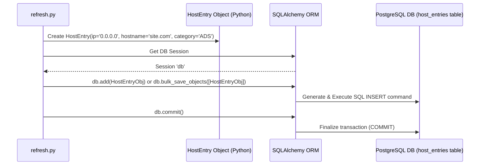
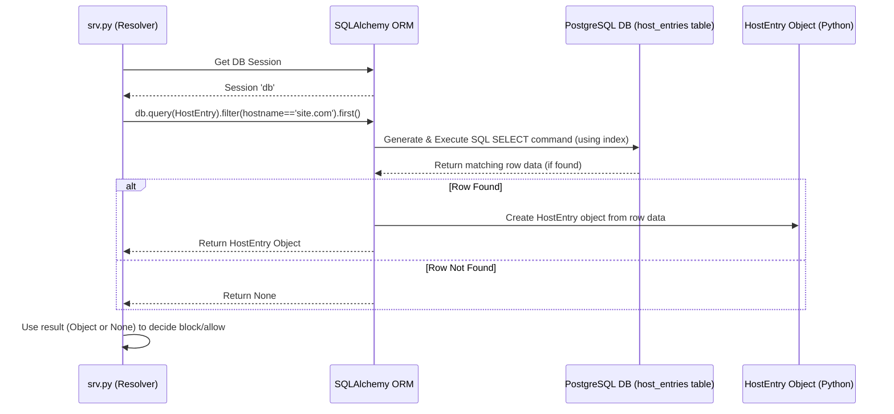

# Chapter 7: Database ORM (HostEntry)

In the previous chapters, especially [Chapter 4: Blocklist Data Management](04_blocklist_data_management.md), we saw how NetSieve fetches lists of domains to block and uses them in [Chapter 3: DNS Query Resolution](03_dns_query_resolution.md) to check incoming requests. But where does NetSieve actually *store* all this blocklist information? Memorizing potentially millions of domains isn't practical. It needs an organized storage system.

This chapter explains how NetSieve uses a database and a special tool called an **Object-Relational Mapper (ORM)** to manage this information, focusing on the `HostEntry` structure.

## What Problem Does This Solve? Organizing the Blocklist Data

Imagine you have thousands of sticky notes, each with a website address that needs to be blocked. Piling them on your desk would be chaotic! How would you quickly find out if `bad-ad-site.com` is on one of those notes? You need a system.

This is the problem NetSieve faces with blocklist data. It needs:

1.  **Organized Storage:** A way to store potentially millions of blocked domains efficiently.
2.  **Structure:** A consistent format for storing information about each blocked domain (like its name, the IP address associated in the list, and which category it belongs to).
3.  **Easy Access:** A simple way for the code (like the blocklist checker in `srv.py`) to quickly look up if a domain exists in the storage.
4.  **Code-Friendly Interaction:** A way for Python scripts (like `refresh.py`) to add new entries or check existing ones without writing complicated database commands manually.

**Use Case:** The `refresh.py` script downloads a blocklist and finds the line `0.0.0.0 annoying-ad-site.com`. It knows this site belongs to the `ADWARE_MALWARE_LINK` category. How does NetSieve store this information (`0.0.0.0`, `annoying-ad-site.com`, `ADWARE_MALWARE_LINK`) in a way that the DNS resolver can later quickly check if `annoying-ad-site.com` should be blocked?

The **Database ORM** and the `HostEntry` class provide the solution.

## Key Concepts: Database, ORM, and HostEntry

Let's break down the tools NetSieve uses:

1.  **Database:** Think of this as a large, highly organized digital filing cabinet. It's designed to store and retrieve vast amounts of data quickly and reliably. NetSieve uses a PostgreSQL database.

2.  **Database Table (`host_entries`):** Inside the filing cabinet, there's a specific drawer labeled "Blocked Hosts". This drawer only holds information about blocked domains. It's structured like a spreadsheet with specific columns: `id` (a unique number for each entry), `ip` (like `0.0.0.0`), `hostname` (like `annoying-ad-site.com`), and `category` (like `ADWARE_MALWARE_LINK`). Each row in this table represents one blocked host entry.

3.  **Python Class (`HostEntry`):** This is like a **blueprint** written in Python code. It defines exactly what information a single blocked host entry should contain. It specifies that each `HostEntry` *must* have an `ip`, a `hostname`, and a `category`.

    ```python
    # File: scripts/models.py (Simplified Definition)
    from sqlalchemy import Column, Integer, String, Index
    from sqlalchemy.orm import declarative_base

    Base = declarative_base() # Base class for our blueprints

    class HostEntry(Base): # Our blueprint class
        __tablename__ = 'host_entries' # Links to the 'host_entries' table

        # Define the 'columns' or fields for each entry
        id = Column(Integer, primary_key=True) # Auto-assigned unique ID
        ip = Column(String, nullable=False) # IP address (can't be empty)
        hostname = Column(String, nullable=False) # Domain name (can't be empty)
        category = Column(String, nullable=False) # Category (can't be empty)

        # Create an index on 'hostname' for faster lookups
        __table_args__ = (Index('idx_hostname', 'hostname'),)
    ```
    *   `class HostEntry(Base)`: Declares our Python blueprint named `HostEntry`.
    *   `__tablename__ = 'host_entries'`: Tells the ORM that this blueprint corresponds to the `host_entries` table in the database.
    *   `Column(...)`: Defines the properties (like columns in a spreadsheet) each `HostEntry` object will have and their types (`Integer`, `String`). `nullable=False` means these fields must have a value.
    *   `Index(...)`: Tells the database to create a special index (like an index in the back of a book) for the `hostname` column. This makes searching for a specific hostname *much* faster, which is crucial for the DNS resolver.

4.  **ORM (SQLAlchemy):** This is the magic **translator** or **bridge**. Databases understand a language called SQL (Structured Query Language), while our application uses Python. Writing SQL manually can be tedious and error-prone. An ORM like SQLAlchemy translates between our Python `HostEntry` objects (the blueprints) and the rows in the `host_entries` database table (the storage boxes).
    *   When `refresh.py` wants to save a new blocked host, it creates a Python `HostEntry` object. The ORM takes this object and automatically generates the correct SQL `INSERT` command to add a new row to the `host_entries` table.
    *   When `srv.py` wants to check if a hostname is blocked, it asks the ORM using Python code (e.g., "find a `HostEntry` where `hostname` equals 'annoying-ad-site.com'"). The ORM translates this into a SQL `SELECT` query, runs it against the database, and if it finds a matching row, translates that row back into a Python `HostEntry` object.

This allows NetSieve developers to work primarily with familiar Python objects, simplifying database interactions significantly.

## How NetSieve Uses the ORM and HostEntry

You don't typically interact with `HostEntry` directly as an end-user. Instead, other parts of NetSieve rely on it:

1.  **Connecting to the Database (`scripts/models.py`):** First, NetSieve needs to know how to connect to the database. It reads the connection details (host, user, password, database name) from environment variables (configured as discussed in [Chapter 1: System Configuration](01_system_configuration.md)). SQLAlchemy uses these details to set up a connection "engine" and a way to create database "sessions" (temporary connections for performing operations).

    ```python
    # File: scripts/models.py (Simplified Connection Setup)
    import os
    from dotenv import load_dotenv
    from sqlalchemy import create_engine
    from sqlalchemy.orm import sessionmaker

    load_dotenv('.env.prod') # Load DB credentials from .env file

    DATABASE_USER = os.getenv("DATABASE_USER")
    DATABASE_PASSWORD = os.getenv("DATABASE_PASSWORD")
    DATABASE_HOST = os.getenv("DATABASE_HOST") # e.g., 'your-db.example.com'
    DATABASE_NAME = os.getenv("DATABASE_NAME")

    # Construct the connection URL (simplified)
    DATABASE_URL = f"postgresql+psycopg2://{DATABASE_USER}:{DATABASE_PASSWORD}@{DATABASE_HOST}/{DATABASE_NAME}"

    # Create the engine: the core interface to the database
    engine = create_engine(DATABASE_URL)

    # Create a factory for sessions: manages individual conversations with the DB
    SessionLocal = sessionmaker(autocommit=False, autoflush=False, bind=engine)
    ```
    *   This code reads settings loaded from a `.env.prod` file.
    *   It builds a `DATABASE_URL` string that SQLAlchemy understands.
    *   `create_engine` sets up the main connection pathway.
    *   `sessionmaker` creates a tool (`SessionLocal`) to easily start and manage short conversations (sessions) with the database.

2.  **Saving Blocked Hosts (`scripts/refresh.py`):** When the blocklist refresher runs ([Chapter 4: Blocklist Data Management](04_blocklist_data_management.md)), it parses the downloaded files. For each entry (like `0.0.0.0 annoying-ad-site.com` in the `ADWARE_MALWARE_LINK` category), it creates a `HostEntry` object and uses a database session to save it.

    ```python
    # File: scripts/refresh.py (Simplified Saving Logic)
    from models import HostEntry, SessionLocal # Import blueprint and session factory

    # Assume 'hosts_from_parser' is a list of tuples like:
    # [('0.0.0.0', 'annoying-ad-site.com', 'ADWARE_MALWARE_LINK'), ...]
    hosts_from_parser = [('0.0.0.0', 'annoying-ad-site.com', 'ADWARE_MALWARE_LINK')] # Example

    new_entries = []
    for ip, hostname, category in hosts_from_parser:
        # Create a Python object using the HostEntry blueprint
        entry = HostEntry(ip=ip, hostname=hostname, category=category)
        new_entries.append(entry)

    if new_entries:
        # Start a conversation with the database
        with SessionLocal() as db:
            # Tell SQLAlchemy to save all these new objects (ORM translates to SQL)
            db.bulk_save_objects(new_entries)
            # Finalize the changes in the database
            db.commit()
        print(f"Saved {len(new_entries)} new entries.")
    ```
    *   It creates `HostEntry` Python objects matching the blueprint.
    *   `with SessionLocal() as db:` gets a temporary database connection (session).
    *   `db.bulk_save_objects(new_entries)` efficiently tells the ORM to save all the new Python objects to the database. SQLAlchemy handles the SQL generation.
    *   `db.commit()` makes the changes permanent in the database.

3.  **Checking if a Host is Blocked (`scripts/srv.py`):** When a DNS query arrives, the resolver ([Chapter 3: DNS Query Resolution](03_dns_query_resolution.md)) needs to check if the requested hostname is in the `host_entries` table. It uses a database session to ask the ORM to look for it.

    ```python
    # File: scripts/srv.py (Simplified Checking Logic in DBBlockZone class)
    from models import HostEntry, SessionLocal # Import blueprint and session factory

    def is_hostname_blocked(hostname_to_check):
        # Start a conversation with the database
        with SessionLocal() as db_session:
            # Ask ORM: Find the first HostEntry where hostname matches?
            # (ORM translates to SQL: SELECT * FROM host_entries WHERE hostname = ... LIMIT 1)
            entry = db_session.query(HostEntry).filter(
                HostEntry.hostname == hostname_to_check
            ).first()

            # If entry is not None, it means we found a match (it's blocked)
            if entry is not None:
                return True # Yes, it's blocked
            else:
                return False # No, it's not blocked

    # Example usage:
    if is_hostname_blocked("annoying-ad-site.com"):
        print("annoying-ad-site.com is blocked!")
        # ... block the DNS query ...
    ```
    *   `with SessionLocal() as db_session:` gets a database session.
    *   `db_session.query(HostEntry)` tells the ORM we want to search in the `host_entries` table (represented by the `HostEntry` blueprint).
    *   `.filter(HostEntry.hostname == hostname_to_check)` specifies the condition (find rows where the `hostname` column matches the one we're checking).
    *   `.first()` tells the ORM we only need one result (or `None` if not found). Because of the index we created on `hostname`, this lookup is very fast.
    *   The function returns `True` if an entry was found (meaning it's blocked), `False` otherwise.

## Under the Hood: The ORM in Action

Let's visualize the process:

**Saving Data (refresh.py):**



**Querying Data (srv.py):**



The ORM acts as the intermediary, translating Python actions into database commands and database results back into Python objects.

## Conclusion

The `HostEntry` class acts as a clear Python blueprint for how blocked host information should be structured. SQLAlchemy, the ORM library, serves as the essential translator, bridging the gap between these Python blueprints and the actual `host_entries` table in the PostgreSQL database.

This combination allows NetSieve to:
*   Store blocklist data in a structured and organized way.
*   Enable efficient saving of new entries by `refresh.py`.
*   Allow fast lookups by the DNS resolver in `srv.py` thanks to database indexing.
*   Keep the Python code clean and focused on logic rather than raw SQL commands.

Understanding the `HostEntry` ORM is key to seeing how NetSieve manages its core blocklist data effectively. This chapter concludes our tour of the main components of NetSieve. You've seen how it's configured, how the server runs, how it resolves queries (blocking, local, forwarding), how blocklists are managed, and how the database is structured. Congratulations on completing the NetSieve tutorial!

---

Generated by [AI Codebase Knowledge Builder](https://github.com/The-Pocket/Tutorial-Codebase-Knowledge)