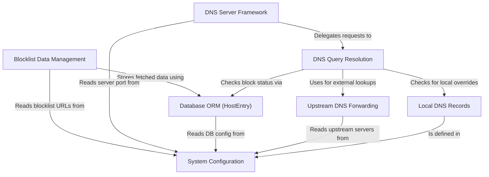

# Tutorial: NetSieve

NetSieve acts as a local *DNS filter*. It receives DNS requests from devices on your network.
If a requested domain (like `ads.example.com`) is found in its *blocklists*, NetSieve prevents access by replying with `0.0.0.0`.
Otherwise, it checks for *local overrides* or forwards the request to a public **upstream DNS server** (like Cloudflare or Google) to get the real IP address.
The blocklists are automatically downloaded and updated from online sources defined in the **configuration**.

**Source Repository:** [https://github.com/krishnadeepy/NetSieve](https://github.com/krishnadeepy/NetSieve)

## Chapters

1. [System Configuration](01_system_configuration.md)
2. [DNS Server Framework](02_dns_server_framework.md)
3. [DNS Query Resolution](03_dns_query_resolution.md)
4. [Blocklist Data Management](04_blocklist_data_management.md)
5. [Local DNS Records](05_local_dns_records.md)
6. [Upstream DNS Forwarding](06_upstream_dns_forwarding.md)
7. [Database ORM (HostEntry)](07_database_orm__hostentry_.md)
